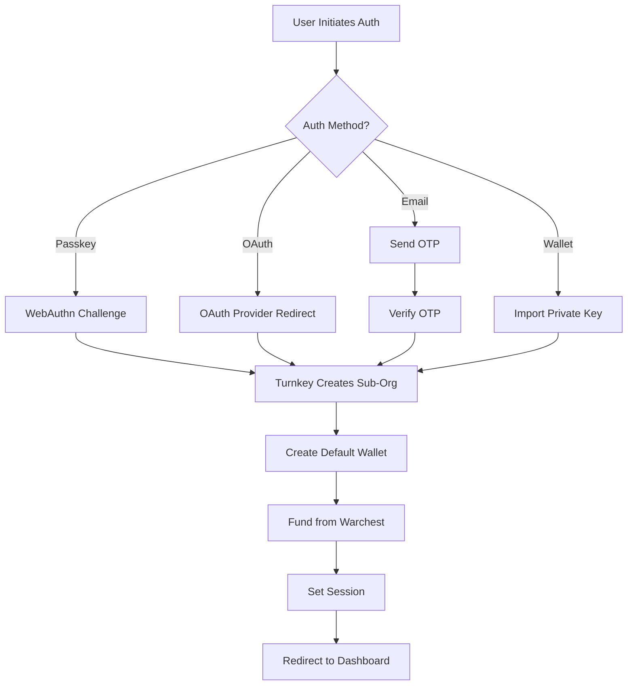

# Turnkey Embedded Wallet Demo

A comprehensive Next.js 14+ demonstration of Turnkey's embedded wallet functionality with multiple authentication methods, automatic wallet funding, and full blockchain integration.

## Table of Contents

- [Overview](#overview)
- [Features](#features)
- [Architecture](#architecture)
- [Technology Stack](#technology-stack)
- [Prerequisites](#prerequisites)
- [Environment Variables](#environment-variables)
- [Setup Instructions](#setup-instructions)
- [How It Works](#how-it-works)
- [Authentication Flows](#authentication-flows)
- [Turnkey Integration](#turnkey-integration)
- [Blockchain Integration](#blockchain-integration)
- [Development](#development)
- [Project Structure](#project-structure)

## Overview

This application demonstrates a production-ready embedded wallet solution using Turnkey's infrastructure. Users can authenticate through multiple methods (passkeys, OAuth providers, email OTP, or wallet import), and each user automatically receives a funded Ethereum wallet on Sepolia testnet.

**Live Demo Flow:**
1. User authenticates via Google/Apple/Facebook OAuth, email, passkey, or wallet import
2. Turnkey creates a sub-organization for the user with an embedded wallet
3. Application automatically funds the new wallet with 0.01 ETH from a "warchest"
4. User can view balances, transaction history, send ETH, and manage their wallet

## Features

### Authentication Methods
- **Passkeys (WebAuthn)** - Biometric authentication with device-native security
- **OAuth Providers** - Google, Apple, and Facebook login
- **Email OTP** - One-time password sent via email
- **Wallet Import** - Import existing wallets via private key or mnemonic

### Wallet Capabilities
- View ETH and ERC-20 token balances
- Transaction history with send/receive categorization
- Send ETH to any address
- QR code for receiving funds
- Wallet export functionality
- Session management with auto-refresh

### Developer Features
- Type-safe environment variables with Zod validation
- Server actions for secure Turnkey and blockchain operations
- Responsive UI with shadcn/ui components
- Dark mode support (configurable)
- Comprehensive error handling

## Architecture

### Provider Hierarchy

The application uses a nested provider pattern for managing global state:

```
ThemeProvider (UI theming)
  └─ TurnkeyProvider (Turnkey SDK context)
      └─ AuthProvider (Authentication state)
          └─ App Routes
```

See [src/providers/index.tsx](src/providers/index.tsx) for implementation.

### Authentication Flow



### Route Organization

**Route Groups:**
- `(landing)/` - Unauthenticated pages (login, OAuth callbacks, email verification)
- `(dashboard)/` - Authenticated pages (wallet dashboard, settings)

### Data Flow

1. **Client-Side**: User interactions trigger authentication flows via Turnkey SDK
2. **Server Actions**: Secure operations execute on server (user creation, wallet funding, transactions)
3. **Blockchain**: Alchemy SDK handles balance queries and transaction history
4. **Turnkey API**: All wallet operations go through Turnkey's infrastructure

## Technology Stack

### Core Framework
- **Next.js 14.1** - React framework with App Router
- **React 18.3** - UI library
- **TypeScript 5.4** - Type safety

### Turnkey SDKs
- `@turnkey/sdk-react` (5.2.1) - React hooks and context
- `@turnkey/sdk-browser` (5.2.1) - Browser-based auth client
- `@turnkey/sdk-server` (4.1.1) - Server-side operations
- `@turnkey/react-wallet-kit` (1.0.0-beta.0) - Pre-built wallet components
- `@turnkey/viem` (0.9.7) - Viem integration for signing
- `@turnkey/wallet-stamper` (1.0.4) - Wallet import/export
- `@turnkey/crypto` (2.4.0) - Cryptographic utilities
- `@turnkey/http` (3.4.2) - HTTP client for Turnkey API

### Blockchain
- **viem 2.31** - Ethereum library for wallet operations
- **Alchemy SDK 3.4** - Blockchain data provider (balances, transactions, gas)

### Authentication
- `@react-oauth/google` - Google OAuth
- `react-apple-login` - Apple Sign In
- `react-facebook-login` - Facebook Login
- `jsonwebtoken` - JWT token handling

### UI Components
- **shadcn/ui** - Component library built on Radix UI
- **Radix UI** - Unstyled, accessible components
- **Tailwind CSS 4.1** - Utility-first CSS
- **lucide-react** - Icon library
- **next-themes** - Theme management

### Validation & Forms
- **Zod 3.23** - Schema validation
- **React Hook Form 7.53** - Form management
- `@t3-oss/env-nextjs` - Type-safe environment variables

### Other Libraries
- `sonner` - Toast notifications
- `react-qr-code` - QR code generation
- `input-otp` - OTP input component
- `usehooks-ts` - TypeScript-friendly React hooks

## Prerequisites

Before setting up this application, you'll need:

### Turnkey Account
1. Sign up at [turnkey.com](https://turnkey.com)
2. Create a parent organization
3. Generate API keys for:
   - Parent organization (for creating sub-orgs)
   - Warchest organization (for funding new wallets)
4. Set up an Auth Proxy for OAuth flows

### OAuth Provider Setup (Optional)
- **Google OAuth**: Create project in [Google Cloud Console](https://console.cloud.google.com)
- **Apple Sign In**: Configure in [Apple Developer](https://developer.apple.com)
- **Facebook Login**: Set up app in [Meta for Developers](https://developers.facebook.com)

### Blockchain Provider
- **Alchemy Account**: Sign up at [alchemy.com](https://www.alchemy.com) for API key

### Other APIs
- **CoinGecko API**: Get key from [coingecko.com](https://www.coingecko.com/en/api) for price data

## Environment Variables

Create a `.env.local` file in the root directory. All variables below are required unless marked optional.

### Application URLs

```bash
# Your application's base URL
NEXT_PUBLIC_APP_URL=http://localhost:3000

# Turnkey API base URL (usually production)
NEXT_PUBLIC_BASE_URL=https://api.turnkey.com
```

### Turnkey Configuration

```bash
# Your Turnkey parent organization ID
NEXT_PUBLIC_ORGANIZATION_ID=your-organization-id

# Relying Party ID for passkeys (usually your domain without protocol)
# For localhost: use "localhost"
# For production: use your domain like "app.example.com"
NEXT_PUBLIC_RP_ID=localhost

# Auth Proxy ID from Turnkey (required for OAuth flows)
NEXT_PUBLIC_AUTH_PROXY_ID=your-auth-proxy-id

# Auth Proxy URL (optional, defaults to Turnkey's hosted proxy)
NEXT_PUBLIC_AUTH_PROXY_URL=https://auth.turnkey.com
```

### Turnkey API Credentials

**Parent Organization API Keys** (for creating sub-organizations):
```bash
# Public key for your parent organization API user
TURNKEY_API_PUBLIC_KEY=your-api-public-key

# Private key for your parent organization API user (keep secret!)
TURNKEY_API_PRIVATE_KEY=your-api-private-key
```

**Warchest Configuration** (for auto-funding new wallets):
```bash
# Organization ID of your warchest (can be same as parent org)
TURNKEY_WARCHEST_ORGANIZATION_ID=your-warchest-org-id

# API credentials for the warchest organization
TURNKEY_WARCHEST_API_PUBLIC_KEY=your-warchest-public-key
TURNKEY_WARCHEST_API_PRIVATE_KEY=your-warchest-private-key

# The private key ID within the warchest to use for funding
WARCHEST_PRIVATE_KEY_ID=your-private-key-id
```

### OAuth Provider Credentials

**Google OAuth:**
```bash
NEXT_PUBLIC_GOOGLE_OAUTH_CLIENT_ID=your-google-client-id.apps.googleusercontent.com
```

**Apple Sign In:**
```bash
NEXT_PUBLIC_APPLE_OAUTH_CLIENT_ID=com.yourapp.service-id
```

**Facebook Login:**
```bash
NEXT_PUBLIC_FACEBOOK_CLIENT_ID=your-facebook-app-id

# Graph API version (check Facebook docs for latest)
NEXT_PUBLIC_FACEBOOK_GRAPH_API_VERSION=21.0

# Auth SDK version
NEXT_PUBLIC_FACEBOOK_AUTH_VERSION=11.0

# Random alphanumeric string for additional security
FACEBOOK_SECRET_SALT=generate-random-string-here
```

### Blockchain Provider

```bash
# Alchemy API key (get from alchemy.com)
# Used for Ethereum Sepolia testnet
NEXT_PUBLIC_ALCHEMY_API_KEY=your-alchemy-api-key
```

### Price Data

```bash
# CoinGecko API key for fetching crypto prices
COINGECKO_API_KEY=your-coingecko-api-key
```

### Optional: Custom Turnkey iFrames

If you're hosting your own Turnkey iframes (advanced):
```bash
NEXT_PUBLIC_AUTH_IFRAME_URL=https://your-auth-iframe-url
NEXT_PUBLIC_EXPORT_IFRAME_URL=https://your-export-iframe-url
NEXT_PUBLIC_IMPORT_IFRAME_URL=https://your-import-iframe-url
```

### Environment Variable Types

The application validates all environment variables at build time using Zod schemas. See [src/env.mjs](src/env.mjs) for the complete validation setup.

**Client-side variables** (prefixed with `NEXT_PUBLIC_`):
- Accessible in browser code
- Bundled into the client JavaScript

**Server-side variables** (no prefix):
- Only accessible in Server Components and Server Actions
- Never exposed to the browser

## Setup Instructions

### 1. Clone and Install

```bash
# Clone the repository
git clone <repository-url>
cd demo-embedded-wallet

# Install dependencies
pnpm install
# or
npm install
# or
yarn install
```

### 2. Configure Environment

```bash
# Copy the example environment file
cp .env.example .env.local

# Edit .env.local with your credentials
# See "Environment Variables" section above for details
```

### 3. Set Up Turnkey Warchest

The warchest is a funded wallet that automatically sends 0.01 ETH to new users.

1. **Create or designate a Turnkey organization** as your warchest
2. **Create a private key** in that organization with Sepolia ETH
3. **Fund the wallet** with Sepolia ETH (get from [Sepolia faucet](https://sepoliafaucet.com/))
4. **Generate API keys** for the warchest organization
5. **Add credentials** to `.env.local` (see warchest variables above)

The funding logic is in [src/actions/turnkey.ts](src/actions/turnkey.ts) - `fundWallet()` function.

### 4. Configure OAuth Providers (Optional)

**Google OAuth:**
1. Go to [Google Cloud Console](https://console.cloud.google.com)
2. Create a new project or select existing
3. Enable Google+ API
4. Create OAuth 2.0 credentials
5. Add authorized redirect URI: `http://localhost:3000/oauth-callback/google`
6. Copy Client ID to `NEXT_PUBLIC_GOOGLE_OAUTH_CLIENT_ID`

**Apple Sign In:**
1. Go to [Apple Developer](https://developer.apple.com)
2. Create a Service ID
3. Configure Sign In with Apple
4. Add return URL: `http://localhost:3000/oauth-callback/apple`
5. Copy Service ID to `NEXT_PUBLIC_APPLE_OAUTH_CLIENT_ID`

**Facebook Login:**
1. Go to [Meta for Developers](https://developers.facebook.com)
2. Create a new app
3. Add Facebook Login product
4. Add redirect URI: `http://localhost:3000/oauth-callback/facebook`
5. Copy App ID to `NEXT_PUBLIC_FACEBOOK_CLIENT_ID`

### 5. Run Development Server

```bash
pnpm dev
# or
npm run dev
# or
yarn dev
```

Open [http://localhost:3000](http://localhost:3000) in your browser.

### 6. Test Authentication

Try each authentication method:
- Click "Continue with Google/Apple/Facebook"
- Try "Email" authentication
- Try "Passkey" for WebAuthn
- Try "Import Wallet" with an existing private key

## How It Works

### End-to-End User Flow

#### 1. Authentication Phase

When a user visits the application:

1. **Landing Page** ([src/app/(landing)/page.tsx](src/app/(landing)/page.tsx)) displays auth options
2. **User selects authentication method**:
   - **Passkey**: Browser prompts for biometric/security key
   - **OAuth**: Redirects to provider (Google/Apple/Facebook)
   - **Email**: Enters email, receives OTP code
   - **Wallet Import**: Enters private key or mnemonic

3. **Auth flow completes**:
   - For OAuth: User redirected back via callback route
   - For Email: OTP verified on separate page
   - For Passkey: WebAuthn challenge completed
   - For Wallet: Credentials validated and imported

#### 2. Sub-Organization Creation

The [AuthProvider](src/providers/auth-provider.tsx) coordinates all auth methods:

```typescript
// All auth methods converge to createUserSubOrg()
const result = await createUserSubOrg({
  email: userEmail,
  passkey: passkeyData,      // if passkey auth
  oauth: oauthData,          // if OAuth
  wallet: walletData,        // if wallet import
})
```

This server action ([src/actions/turnkey.ts](src/actions/turnkey.ts)) then:

1. **Creates a Turnkey sub-organization** for the user
2. **Creates a default Ethereum wallet** using BIP-44 path `m/44'/60'/0'/0/0`
3. **Calls `fundWallet()`** to send 0.01 ETH from warchest
4. **Returns user session** with organization details

#### 3. Wallet Funding (Warchest System)

The `fundWallet()` function ([src/actions/turnkey.ts](src/actions/turnkey.ts)):

```typescript
export const fundWallet = async (walletAddress: Address) => {
  // 1. Create Turnkey client with warchest credentials
  const warchestClient = new TurnkeyServerClient({
    organizationId: TURNKEY_WARCHEST_ORGANIZATION_ID,
    stamper: warchestStamper,
  })

  // 2. Create Viem wallet client with Turnkey signer
  const walletClient = getTurnkeyWalletClient(
    warchestClient,
    WARCHEST_PRIVATE_KEY_ID
  )

  // 3. Send 0.01 ETH transaction
  const txHash = await walletClient.sendTransaction({
    to: walletAddress,
    value: parseEther("0.01"),
  })

  return txHash
}
```

This demonstrates:
- **Server-side signing** using Turnkey's API
- **No private keys** ever leave Turnkey's infrastructure
- **Automatic funding** for better UX

#### 4. Session Management

After successful auth:

1. **Session stored** in AuthProvider context and localStorage
2. **Auto-refresh** enabled via Turnkey SDK
3. **Session expiry warnings** shown when close to expiration
4. **User redirected** to `/dashboard`

#### 5. Dashboard Experience

The dashboard ([src/app/(dashboard)/dashboard/page.tsx](src/app/(dashboard)/dashboard/page.tsx)) displays:

**Wallet Overview:**
- ETH balance (fetched via Alchemy)
- USD conversion (via CoinGecko API)
- Wallet address with QR code

**Transaction History:**
- Sent and received transactions
- ERC-20 token transfers
- Transaction metadata (timestamp, amount, recipient/sender)

**Actions:**
- Send ETH to any address
- Copy wallet address
- Export wallet

### Authentication Flows (Detailed)

#### Passkey Flow

```typescript
// 1. User clicks "Sign in with Passkey"
// 2. Browser shows biometric prompt
// 3. WebAuthn creates attestation
const attestation = await navigator.credentials.create(...)

// 4. Send to Turnkey to create sub-org
const result = await createUserSubOrg({
  passkey: {
    attestation,
    challenge: authenticatorAttestationResponse
  }
})

// 5. User logged in with passkey authenticator
```

**Implementation**: [src/providers/auth-provider.tsx](src/providers/auth-provider.tsx) - `loginWithPasskey()`

#### OAuth Flow (Google/Apple/Facebook)

```typescript
// 1. User clicks "Continue with Google"
// 2. Redirect to Google OAuth consent screen
window.location.href = googleAuthUrl

// 3. User approves, Google redirects back with code
// 4. Callback page exchanges code for ID token
const idToken = await exchangeToken(code)

// 5. Send ID token to Turnkey
const result = await oauth({
  oidcToken: idToken,
  provider: 'Google'
})

// 6. Turnkey creates sub-org using OAuth identity
```

**Implementation**:
- Initiation: [src/providers/auth-provider.tsx](src/providers/auth-provider.tsx) - `loginWithOauth()`
- Callbacks: [src/app/(landing)/oauth-callback/](src/app/(landing)/oauth-callback/)
- Token exchange: [src/actions/turnkey.ts](src/actions/turnkey.ts) - `exchangeToken()`

#### Email OTP Flow

```typescript
// 1. User enters email address
const { otpId } = await initEmailAuth({ email })

// 2. User receives OTP code via email
// 3. User enters OTP code
const result = await verifyOtp({
  otpId,
  otpCode: userInput
})

// 4. Turnkey creates sub-org with email authenticator
```

**Implementation**:
- Initiation: [src/app/(landing)/email-auth/page.tsx](src/app/(landing)/email-auth/page.tsx)
- Verification: [src/app/(landing)/verify-email/page.tsx](src/app/(landing)/verify-email/page.tsx)
- Server actions: [src/actions/turnkey.ts](src/actions/turnkey.ts) - `initEmailAuth()`, `verifyOtp()`

#### Wallet Import Flow

```typescript
// 1. User enters private key or mnemonic
const encryptedBundle = await walletStamper.injectWallet({
  privateKey: userInput,
  walletType: WalletType.PrivateKey
})

// 2. Create sub-org with imported wallet
const result = await createUserSubOrg({
  wallet: {
    encryptedBundle,
    userId: publicKey
  }
})

// 3. Imported wallet available in sub-org
```

**Implementation**: [src/providers/auth-provider.tsx](src/providers/auth-provider.tsx) - `loginWithWallet()`

## Turnkey Integration

### SDK Architecture

This application uses multiple Turnkey SDKs for different purposes:

**Client-Side SDKs:**
- `@turnkey/sdk-react` - React Context and hooks for auth state
- `@turnkey/sdk-browser` - Browser-based authentication client
- `@turnkey/react-wallet-kit` - Pre-built wallet UI components
- `@turnkey/wallet-stamper` - Wallet import/export with encryption

**Server-Side SDKs:**
- `@turnkey/sdk-server` - Node.js client for Turnkey API
- `@turnkey/viem` - Integration with viem for transaction signing

**Utility SDKs:**
- `@turnkey/crypto` - Cryptographic operations (key compression, etc.)
- `@turnkey/encoding` - Encoding utilities
- `@turnkey/http` - Base HTTP client

### Configuration

Turnkey configuration is centralized in [src/config/turnkey.ts](src/config/turnkey.ts):

```typescript
export const turnkeyConfig: TurnkeyProviderConfig = {
  organizationId: NEXT_PUBLIC_ORGANIZATION_ID,
  authProxyConfigId: NEXT_PUBLIC_AUTH_PROXY_ID,
  apiBaseUrl: NEXT_PUBLIC_BASE_URL,

  auth: {
    autoRefreshSession: true,  // Automatically refresh before expiry

    oauthConfig: {
      oauthRedirectUri: NEXT_PUBLIC_APP_URL,
      googleClientId: NEXT_PUBLIC_GOOGLE_OAUTH_CLIENT_ID,
      appleClientId: NEXT_PUBLIC_APPLE_OAUTH_CLIENT_ID,
      facebookClientId: NEXT_PUBLIC_FACEBOOK_CLIENT_ID,
    },

    createSuborgParams: {
      // Default wallet configuration for all auth methods
      passkeyAuth: { customWallet },
      emailOtpAuth: { customWallet },
      oauth: { customWallet },
    },
  },
}
```

**Default Wallet Configuration:**
```typescript
export const customWallet = {
  walletName: "Default Wallet",
  walletAccounts: [{
    curve: "CURVE_SECP256K1",           // Ethereum curve
    pathFormat: "PATH_FORMAT_BIP32",
    path: "m/44'/60'/0'/0/0",           // BIP-44 Ethereum path
    addressFormat: "ADDRESS_FORMAT_ETHEREUM",
  }],
}
```

### Server Actions with Turnkey

All Turnkey operations that require API credentials run as server actions:

```typescript
// src/actions/turnkey.ts
"use server"

// Create API key stamper (server-side only)
const stamper = new ApiKeyStamper({
  apiPublicKey: TURNKEY_API_PUBLIC_KEY,
  apiPrivateKey: TURNKEY_API_PRIVATE_KEY,
})

// Create Turnkey client
const client = new TurnkeyServerClient({
  apiBaseUrl: NEXT_PUBLIC_BASE_URL,
  organizationId: turnkeyConfig.organizationId,
  stamper,
})

// Use client for operations
export const createUserSubOrg = async (params) => {
  const result = await client.createSubOrganization({...})
  return result
}
```

**Why Server Actions?**
- API keys never exposed to browser
- Secure server-side execution
- Type-safe RPC from client components

### Sub-Organization Model

Each user gets their own Turnkey sub-organization:

**Parent Organization** (your Turnkey account):
- Manages API keys for creating sub-orgs
- Hosts warchest wallet
- Controls overall permissions

**Sub-Organizations** (one per user):
- Isolated wallet infrastructure
- User-specific authenticators (passkeys, OAuth, etc.)
- Independent key management
- User cannot access other users' wallets

**Benefits:**
- Complete isolation between users
- Users can export their wallets
- Flexible auth methods per user
- Scalable architecture

## Blockchain Integration

### Alchemy SDK Setup

The application uses Alchemy for all Ethereum interactions on Sepolia testnet:

```typescript
// src/actions/web3.ts
import { Alchemy, Network } from "alchemy-sdk"

const settings = {
  apiKey: env.NEXT_PUBLIC_ALCHEMY_API_KEY,
  network: Network.ETH_SEPOLIA,
}

const alchemy = new Alchemy(settings)
```

### Balance Queries

```typescript
export const getBalance = async (address: Address) => {
  const response = await alchemy.core.getBalance(address, "latest")
  return BigInt(response.toString())
}

export const getTokenBalance = async (address: Address) => {
  const tokenBalances = await alchemy.core.getTokenBalances(address)
  return tokenBalances
}
```

### Transaction History

```typescript
export const getTransactions = async (address: Address) => {
  // Fetch sent and received concurrently
  const [sentResponse, receivedResponse] = await Promise.all([
    alchemy.core.getAssetTransfers({
      fromAddress: address,
      category: [
        AssetTransfersCategory.ERC20,
        AssetTransfersCategory.EXTERNAL,
        AssetTransfersCategory.INTERNAL,
      ],
      withMetadata: true,
    }),
    alchemy.core.getAssetTransfers({
      toAddress: address,
      category: [/* same categories */],
      withMetadata: true,
    }),
  ])

  // Combine and categorize
  return {
    sent: sentResponse.transfers,
    received: receivedResponse.transfers,
  }
}
```

### Sending Transactions (Turnkey + Viem)

Transaction signing uses Turnkey's signer integrated with viem:

```typescript
// src/lib/web3.ts
import { createWalletClient } from "viem"
import { createAccount } from "@turnkey/viem"

export const getTurnkeyWalletClient = (
  turnkeyClient: TurnkeyServerClient,
  privateKeyId: string
) => {
  // Create Turnkey account (signer)
  const account = createAccount({
    client: turnkeyClient,
    privateKeyId,
  })

  // Create viem wallet client with Turnkey signer
  return createWalletClient({
    account,
    chain: sepolia,
    transport: http(`https://eth-sepolia.g.alchemy.com/v2/${ALCHEMY_API_KEY}`),
  })
}

// Usage in server action
export const sendTransaction = async (to: Address, value: bigint) => {
  const walletClient = getTurnkeyWalletClient(client, privateKeyId)

  const txHash = await walletClient.sendTransaction({
    to,
    value,
  })

  return txHash
}
```

**Key Points:**
- Private keys never leave Turnkey's infrastructure
- Signing happens via Turnkey API
- Viem handles transaction construction and broadcasting
- Full type safety with TypeScript

### Gas Estimation

```typescript
// Alchemy provides gas price estimates
const gasPrice = await alchemy.core.getGasPrice()

// Estimate gas for transaction
const gasEstimate = await alchemy.core.estimateGas({
  to: recipientAddress,
  value: parseEther("0.01"),
})
```

## Development

### Available Scripts

```bash
# Start development server (hot reload enabled)
pnpm dev

# Build for production
pnpm build

# Start production server
pnpm start

# Run ESLint
pnpm lint

# Format code with Prettier
pnpm format

# Check formatting without modifying
pnpm format:check
```

### Code Quality Tools

**ESLint**: Configured for Next.js with TypeScript
**Prettier**: Auto-formats code and sorts imports/Tailwind classes
- Plugin: `@ianvs/prettier-plugin-sort-imports`
- Plugin: `prettier-plugin-tailwindcss`

### Type Safety

**Environment Variables**: Validated at build time with Zod schemas
**TypeScript**: Strict mode enabled
**API Responses**: Typed interfaces for all Turnkey and Alchemy responses

Example type definitions in [src/types/turnkey.ts](src/types/turnkey.ts):

```typescript
export interface UserSession {
  id: string
  name: string
  email: string
  organization: {
    organizationId: string
    organizationName: string
  }
}

export interface Wallet {
  walletId: string
  walletName: string
  addresses: Address[]
}
```

### Adding New Features

**New Authentication Method:**
1. Add provider credentials to [src/env.mjs](src/env.mjs)
2. Update [src/config/turnkey.ts](src/config/turnkey.ts) with provider config
3. Add auth method to [src/providers/auth-provider.tsx](src/providers/auth-provider.tsx)
4. Create callback route in [src/app/(landing)/oauth-callback/](src/app/(landing)/oauth-callback/)

**New Blockchain Network:**
1. Update Alchemy network in [src/actions/web3.ts](src/actions/web3.ts)
2. Update viem chain in [src/lib/web3.ts](src/lib/web3.ts)
3. Update wallet configuration in [src/config/turnkey.ts](src/config/turnkey.ts) with appropriate derivation path

**New Server Action:**
1. Add to [src/actions/](src/actions/) directory
2. Use `"use server"` directive
3. Import and call from Client Components
4. Add proper TypeScript types

## Project Structure

```
demo-embedded-wallet/
├── src/
│   ├── app/                          # Next.js App Router
│   │   ├── (landing)/                # Unauthenticated routes
│   │   │   ├── page.tsx              # Login page
│   │   │   ├── email-auth/           # Email OTP initiation
│   │   │   ├── verify-email/         # OTP verification
│   │   │   └── oauth-callback/       # OAuth redirect handlers
│   │   │       ├── google/
│   │   │       ├── apple/
│   │   │       └── facebook/
│   │   ├── (dashboard)/              # Authenticated routes
│   │   │   ├── dashboard/            # Main wallet dashboard
│   │   │   └── settings/             # User settings
│   │   ├── layout.tsx                # Root layout
│   │   └── globals.css               # Global styles
│   │
│   ├── actions/                      # Server Actions
│   │   ├── turnkey.ts                # Turnkey operations (user creation, auth)
│   │   └── web3.ts                   # Blockchain operations (balances, transactions)
│   │
│   ├── components/                   # React components
│   │   ├── ui/                       # shadcn/ui components
│   │   ├── auth/                     # Authentication components
│   │   ├── wallet/                   # Wallet-related components
│   │   └── layouts/                  # Layout components
│   │
│   ├── config/                       # Configuration files
│   │   ├── site.ts                   # Site metadata and constants
│   │   └── turnkey.ts                # Turnkey SDK configuration
│   │
│   ├── lib/                          # Utility functions
│   │   ├── web3.ts                   # Web3 utilities (viem client creation)
│   │   ├── storage.ts                # localStorage utilities
│   │   └── utils.ts                  # General utilities
│   │
│   ├── providers/                    # React Context providers
│   │   ├── index.tsx                 # Main provider wrapper
│   │   ├── auth-provider.tsx         # Authentication state
│   │   └── theme-provider.tsx        # Theme management
│   │
│   ├── types/                        # TypeScript type definitions
│   │   ├── turnkey.ts                # Turnkey-related types
│   │   └── web3.ts                   # Web3-related types
│   │
│   └── env.mjs                       # Environment variable validation
│
├── public/                           # Static assets
├── .env.example                      # Example environment variables
├── .env.local                        # Your local environment (not committed)
├── next.config.js                    # Next.js configuration
├── tailwind.config.ts                # Tailwind CSS configuration
├── tsconfig.json                     # TypeScript configuration
├── package.json                      # Dependencies and scripts
└── README.md                         # This file
```

### Key Files

- [src/providers/index.tsx](src/providers/index.tsx) - Provider hierarchy setup
- [src/providers/auth-provider.tsx](src/providers/auth-provider.tsx) - Authentication state management
- [src/config/turnkey.ts](src/config/turnkey.ts) - Turnkey SDK configuration
- [src/actions/turnkey.ts](src/actions/turnkey.ts) - Turnkey server operations
- [src/actions/web3.ts](src/actions/web3.ts) - Blockchain interactions
- [src/env.mjs](src/env.mjs) - Environment variable validation
- [src/lib/web3.ts](src/lib/web3.ts) - Viem wallet client creation

---

## Support

For issues or questions:
- **Turnkey Documentation**: [docs.turnkey.com](https://docs.turnkey.com)
- **Alchemy Documentation**: [docs.alchemy.com](https://docs.alchemy.com)
- **Next.js Documentation**: [nextjs.org/docs](https://nextjs.org/docs)

## License

See LICENSE file.
