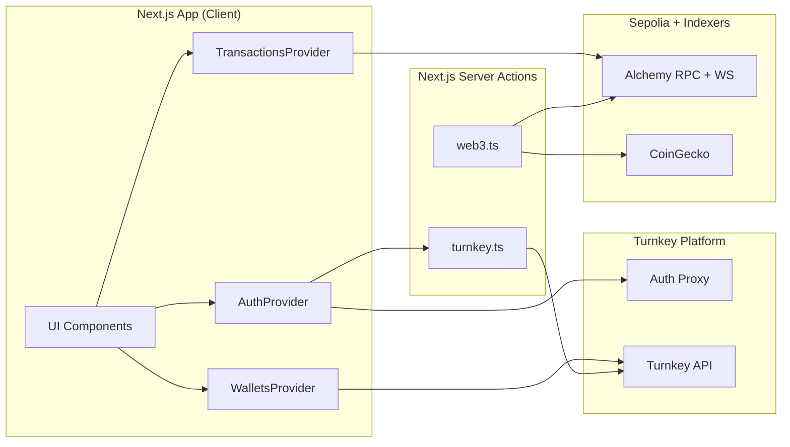
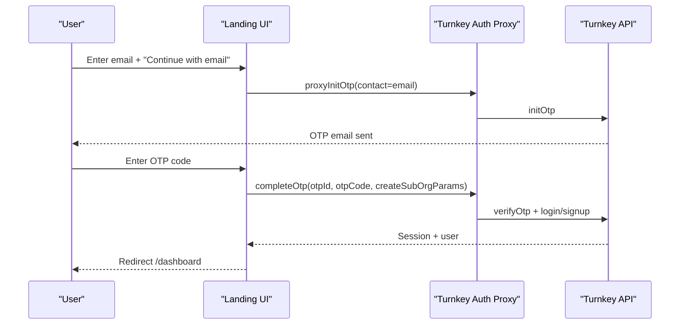
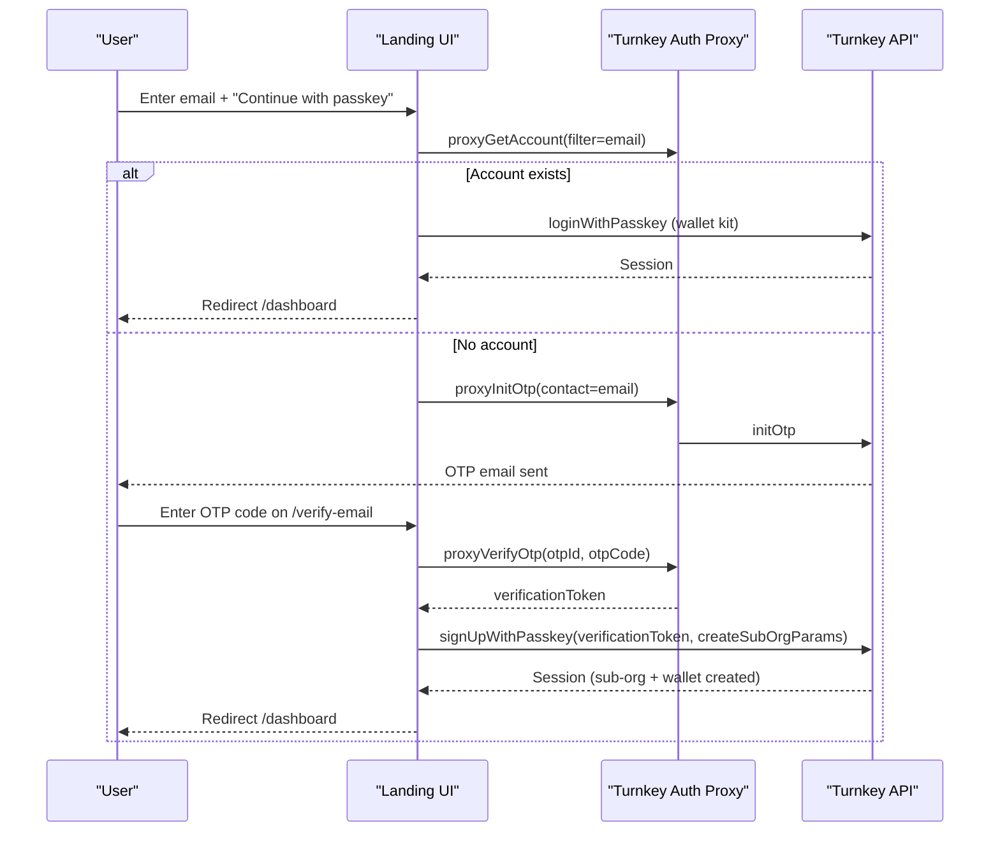
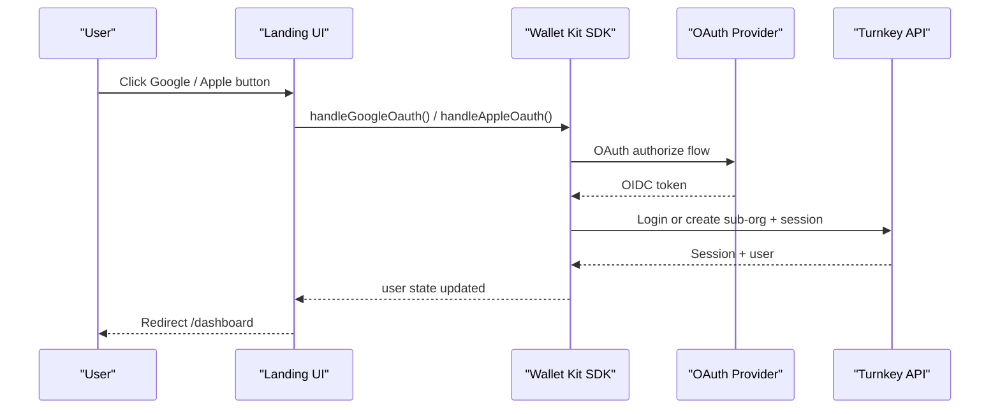
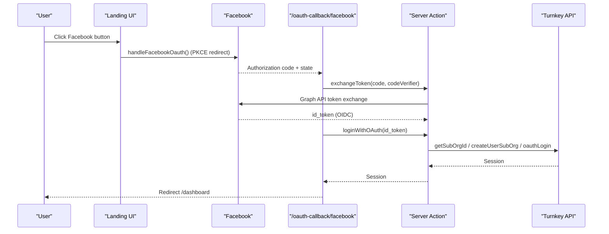
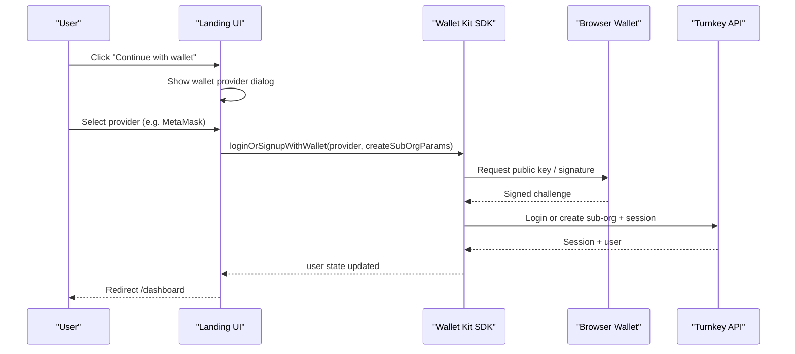
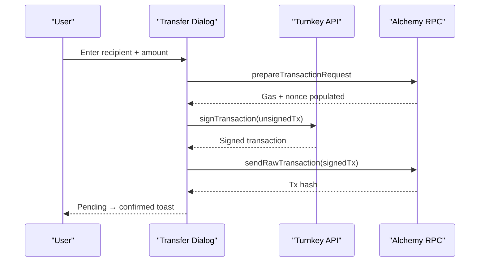
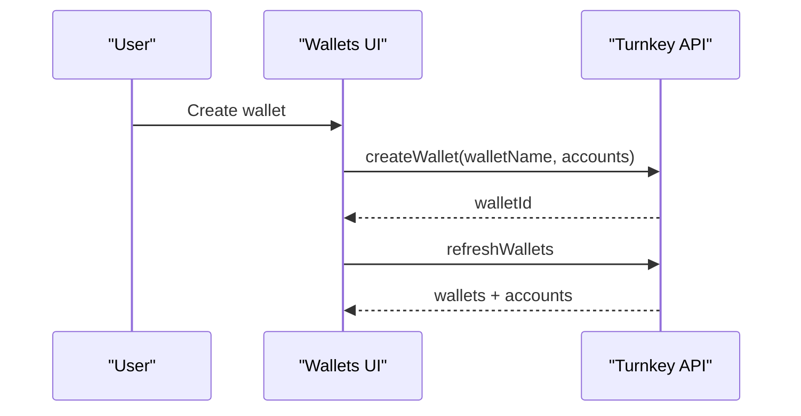
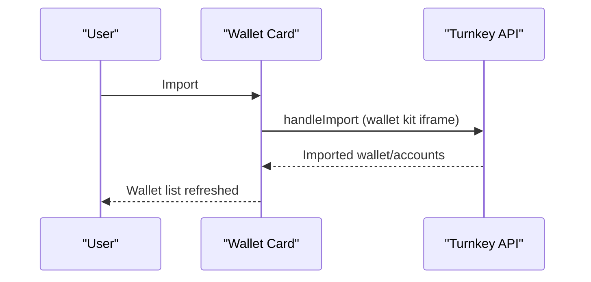
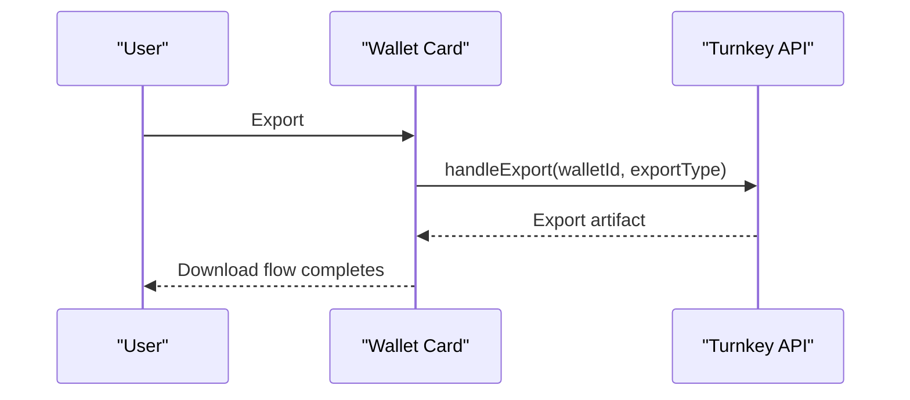

# Demo Embedded Wallet

Turnkey-based embedded wallet demo built with Next.js and Ethereum Sepolia.
This README is written for developers who want to understand the architecture
and fork their own version quickly.

## Table of Contents

- [Quickstart](#quickstart)
- [Configuration](#configuration)
- [Architecture Overview](#architecture-overview)
- [Key Flows (Sequence Diagrams)](#key-flows-sequence-diagrams)
- [Feature Tour (What the App Does)](#feature-tour-what-the-app-does)
- [Turnkey Integration Details](#turnkey-integration-details)
- [Turnkey Troubleshooting](#turnkey-troubleshooting)
- [Email OTP Flows (Context)](#email-otp-flows-context)
- [Target Network](#target-network)
- [Project Structure](#project-structure)
- [Scripts](#scripts)

## Quickstart

1. Install dependencies

```bash
pnpm install
```

2. Create `.env.local`

```bash
cp .env.example .env.local
```

3. Fill environment variables (see "Configuration" below).
4. Run the app

```bash
pnpm dev
```

## Configuration

All environment variables are validated at startup via `@t3-oss/env-nextjs`
in `src/env.mjs`. Required variables live in `.env.example`. Set
`SKIP_ENV_VALIDATION=1` to bypass validation for local builds without
credentials (`pnpm build:local`).

### Turnkey (required)

| Variable | Description |
|---|---|
| `NEXT_PUBLIC_ORGANIZATION_ID` | Your Turnkey parent organization ID |
| `NEXT_PUBLIC_BASE_URL` | Turnkey API base URL (default `https://api.turnkey.com`) |
| `NEXT_PUBLIC_AUTH_PROXY_ID` | Auth Proxy config ID for OTP and passkey flows |
| `NEXT_PUBLIC_APP_URL` | App URL used for OAuth redirect URIs (e.g. `http://localhost:3000`) |
| `TURNKEY_API_PUBLIC_KEY` | Server-side Turnkey API public key |
| `TURNKEY_API_PRIVATE_KEY` | Server-side Turnkey API private key |

### OAuth (required)

| Variable | Description |
|---|---|
| `NEXT_PUBLIC_GOOGLE_OAUTH_CLIENT_ID` | Google OAuth client ID |
| `NEXT_PUBLIC_APPLE_OAUTH_CLIENT_ID` | Apple OAuth client ID |
| `NEXT_PUBLIC_FACEBOOK_CLIENT_ID` | Facebook app ID |
| `NEXT_PUBLIC_FACEBOOK_AUTH_VERSION` | Facebook SDK version (e.g. `11.0`) |
| `NEXT_PUBLIC_FACEBOOK_GRAPH_API_VERSION` | Facebook Graph API version (e.g. `21.0`) |
| `FACEBOOK_SECRET_SALT` | Random alphanumeric string for Facebook OIDC nonce |

### Sepolia funding (warchest)

| Variable | Description |
|---|---|
| `TURNKEY_WARCHEST_ORGANIZATION_ID` | Warchest org ID (separate from main org) |
| `TURNKEY_WARCHEST_API_PUBLIC_KEY` | Warchest API public key |
| `TURNKEY_WARCHEST_API_PRIVATE_KEY` | Warchest API private key |
| `WARCHEST_PRIVATE_KEY_ID` | Private key ID used to sign funding transactions |

### Web3 + pricing (required)

| Variable | Description |
|---|---|
| `NEXT_PUBLIC_ALCHEMY_API_KEY` | Alchemy API key for Sepolia RPC, websockets, and asset transfers |
| `COINGECKO_API_KEY` | CoinGecko demo API key for ETH/USD price |

### Optional

| Variable | Description |
|---|---|
| `NEXT_PUBLIC_AUTH_PROXY_URL` | Auth Proxy endpoint (wallet kit uses default if unset) |
| `NEXT_PUBLIC_RP_ID` | WebAuthn relying party ID for passkeys (auto-detected from app URL in dev) |
| `NEXT_PUBLIC_AUTH_IFRAME_URL` | Custom Turnkey auth iframe URL |
| `NEXT_PUBLIC_EXPORT_IFRAME_URL` | Custom Turnkey export iframe URL |
| `NEXT_PUBLIC_IMPORT_IFRAME_URL` | Custom Turnkey import iframe URL |

## Architecture Overview



### Provider Hierarchy

Root layout (`src/providers/index.tsx`):

```
ThemeProvider (next-themes, forced light)
  └─ TurnkeyProvider (@turnkey/react-wallet-kit)
      └─ AuthProvider (custom context — auth state + login/logout methods)
```

Dashboard layout (`src/app/(dashboard)/layout.tsx`) adds:

```
AuthGuard
  └─ WalletsProvider (wallet/account selection, creation, balance caching)
      └─ NavMenu + page content
```

Dashboard page (`src/app/(dashboard)/dashboard/page.tsx`) adds:

```
TransactionsProvider (tx history + Alchemy websocket watcher)
  └─ WalletCard, Assets, Activity
```

`TransactionsProvider` is scoped to the dashboard page, not the entire
dashboard layout — the settings page does not need transaction state.

`WalletsProvider` uses the `useTurnkey()` hook to read wallets from the
Turnkey session and normalizes them into typed `Wallet[]` with checksummed
addresses. `TransactionsProvider` subscribes to mined transactions via
Alchemy's websocket API and merges them into state in real time.

## Key Flows (Sequence Diagrams)

### Auth: Email OTP (Auth Proxy)



### Auth: Passkey (Existing vs New)



### Auth: OAuth — Google / Apple (Wallet Kit)

Google and Apple are handled entirely by `@turnkey/react-wallet-kit`.
The SDK manages the OIDC flow, sub-org creation, and session internally.



### Auth: OAuth — Facebook (Custom Callback)

Facebook uses a PKCE flow with a custom callback page because the SDK's
`handleFacebookOauth()` redirects the browser to Facebook, which returns
to `/oauth-callback/facebook` with an authorization code.



### Auth: External Wallet (MetaMask, etc.)

The wallet flow is handled by the wallet kit's `loginOrSignupWithWallet()`.
The user selects a provider from a dialog (Solana providers are filtered out).



### Signing & Sending ETH



### Create Wallet + Account



### Import Wallet



### Export Wallet



## Feature Tour (What the App Does)

### Auth

- **Passkey**: Account lookup via Auth Proxy (`proxyGetAccount`). Existing
  users login directly with passkey; new users verify email via OTP first,
  then sign up with passkey (sub-org + wallet created automatically).
- **Email OTP (proxy)**: OTP initiation via Auth Proxy (`proxyInitOtp`).
  User enters 6-digit code on `/verify-email`. `completeOtp()` verifies the
  code and creates a sub-org + session in one call.
- **Email OTP (magic link)**: Legacy flow via custom server actions. Kept as
  reference in `auth-provider.tsx` and `/email-auth` route but not used by
  the primary landing UI.
- **OAuth**: Google and Apple handled entirely by `@turnkey/react-wallet-kit`
  (`handleGoogleOauth()`, `handleAppleOauth()`) — the SDK manages the OIDC
  flow, sub-org creation, and session internally. Facebook uses a custom PKCE
  flow: `handleFacebookOauth()` redirects to Facebook, which returns to
  `/oauth-callback/facebook` with an authorization code; a server action
  (`exchangeToken`) exchanges it for an OIDC token via the Graph API, then
  `loginWithOAuth()` in `auth-provider.tsx` completes the login.
- **External wallet**: `loginOrSignupWithWallet()` from
  `@turnkey/react-wallet-kit`. User picks a provider from a dialog (Solana
  providers are filtered out). The SDK handles sub-org creation if needed.

### Wallets & Accounts

- Wallets loaded from the Turnkey session and normalized (valid Ethereum
  addresses only, checksummed via `getAddress`) in `src/providers/wallet-provider.tsx`.
- Create new wallets (`createWallet`) or add accounts to existing wallets
  (`createWalletAccounts`) — both via `@turnkey/react-wallet-kit` hooks.
- Preferred wallet persisted to localStorage per user ID.
- Multi-wallet and multi-account support with a dropdown selector.
- Balance fetched via viem `getBalance` with an in-memory cache (deduplicates
  concurrent requests for the same address).

### Faucet (Add Funds)

- UI calls `fundWallet` in `src/lib/web3.ts`, which delegates to a server
  action in `src/actions/turnkey.ts`.
- Server action uses a separate Turnkey "warchest" organization to sign and
  send 0.001 ETH to the target address.
- Faucet is one-time only: accounts that have already received at least one
  incoming transfer (checked via Alchemy `getAssetTransfers`, received
  category only) are not eligible.
- Toast notifications show pending/confirmed/error states with Etherscan links.

### Sending Funds

- Transfer dialog (`src/components/transfer-dialog.tsx`) with Send and Receive
  tabs, responsive as a drawer on mobile.
- Transaction prepared via viem `prepareTransactionRequest` with a
  Turnkey-backed `WalletClient` (created by `@turnkey/viem`).
- Gas estimation displayed before confirmation. User reviews recipient, amount,
  and fees in `send-transaction.tsx` before submitting.
- Pending transactions optimistically inserted into activity state via
  `TransactionsProvider.addPendingTransaction`.

### Receiving Funds

- Receive tab shows a QR code (via `react-qr-code`) and the checksummed
  address with a copy-to-clipboard button.

### Activity & Assets

- Transaction history fetched via Alchemy `getAssetTransfers` (sent +
  received, sorted by block number descending).
- Real-time updates via Alchemy websocket subscription
  (`AlchemySubscription.MINED_TRANSACTIONS`) for the selected account address.
- Timeout protection (30s) prevents indefinite loading on slow fetches.
- ETH price fetched from CoinGecko for USD display in assets table and wallet
  card.

### Session Management

- 15-minute session expiry (`SESSION_EXPIRY = 900s`).
- Warning modal shown 30 seconds before expiry
  (`src/components/session-expiry-warning.tsx`).
- Auto session refresh enabled in `TurnkeyProvider` config.
- Logout clears the Turnkey session, IndexedDB keys, and Google auth state.

### Passkey Management

- Settings page (`/settings`) lists all passkeys with creation date and
  credential ID.
- Users can add new passkeys or delete existing ones (deletion disabled when
  only one passkey remains).

## Turnkey Integration Details

### Provider config

`src/config/turnkey.ts` defines the `TurnkeyProviderConfig` passed to
`TurnkeyProvider` in `src/providers/index.tsx`. It includes:
- Organization and Auth Proxy IDs
- OAuth config (Google, Apple, Facebook client IDs + redirect URI)
- Sub-org creation params per auth method (passkey, email OTP, OAuth), each
  with a default Ethereum wallet (`m/44'/60'/0'/0/0`)
- Auto session refresh enabled

### Client SDK packages

| Package | Usage |
|---|---|
| `@turnkey/react-wallet-kit` | `TurnkeyProvider`, `useTurnkey()` for auth flows, wallet CRUD, signing, import/export |
| `@turnkey/sdk-react` | `useTurnkey()` for `passkeyClient`, `indexedDbClient`, `walletClient` |
| `@turnkey/sdk-browser` | `TurnkeyBrowserClient`, `AuthClient`, `SessionType` types |
| `@turnkey/wallet-stamper` | `WalletType` enum for external wallet auth |
| `@turnkey/crypto` | `uncompressRawPublicKey` for public key handling |
| `@turnkey/http` | Type imports for `TurnkeyApiTypes` (used in `src/types/turnkey.ts`) |

### Server SDK packages

| Package | Usage |
|---|---|
| `@turnkey/sdk-server` | `TurnkeyServerClient`, `ApiKeyStamper`, `DEFAULT_ETHEREUM_ACCOUNTS` |
| `@turnkey/viem` | `createAccount` to bridge Turnkey signing into a viem `Account` |

### viem bridge

`src/lib/web3.ts` exports `getTurnkeyWalletClient()` which:
1. Creates a Turnkey-backed viem `Account` via `@turnkey/viem`'s `createAccount`
2. Wraps it in a viem `WalletClient` targeting Sepolia over Alchemy RPC
3. Used for both user transactions (browser client) and warchest funding
   (server client)

## Turnkey Troubleshooting

- **Auth Proxy misconfig**
  - Symptoms: OTP init/verify fails, OAuth returns generic errors.
  - Check `NEXT_PUBLIC_AUTH_PROXY_ID` and `NEXT_PUBLIC_AUTH_PROXY_URL` in
    `.env.local`, and ensure they match the proxy config used in
    `src/config/turnkey.ts`.
- **OAuth redirect mismatch**
  - Symptoms: Google/Apple/Facebook login redirects with provider errors.
  - Fix: Verify the OAuth provider's redirect URI matches your app URL and the
    configured `NEXT_PUBLIC_APP_URL`.
- **Passkey registration/login fails**
  - Symptoms: NotAllowedError or "Invalid state" in passkey flows.
  - Fix: Ensure `NEXT_PUBLIC_RP_ID` matches your deployment domain and that
    you are using HTTPS in production. Localhost works without a custom RP ID.
- **Server actions failing (Turnkey API keys)**
  - Symptoms: 401/403 or "signature invalid" during sub-org creation or OTP.
  - Fix: Validate `TURNKEY_API_PUBLIC_KEY`, `TURNKEY_API_PRIVATE_KEY`, and
    `NEXT_PUBLIC_ORGANIZATION_ID` match the same org. See `src/actions/turnkey.ts`.
- **Faucet (warchest) not funding**
  - Symptoms: "unable to drip" or funding errors.
  - Fix: Ensure the warchest org is funded and all warchest env vars are set:
    `TURNKEY_WARCHEST_*` and `WARCHEST_PRIVATE_KEY_ID`. The faucet only works
    once per account (before any transactions are received).
- **Alchemy or price data errors**
  - Symptoms: zero balances, failed tx fetches, missing USD price.
  - Fix: Confirm `NEXT_PUBLIC_ALCHEMY_API_KEY` and `COINGECKO_API_KEY` are valid.
- **Facebook login fails**
  - Symptoms: Token exchange errors or missing `id_token`.
  - Fix: Verify `NEXT_PUBLIC_FACEBOOK_CLIENT_ID`,
    `NEXT_PUBLIC_FACEBOOK_GRAPH_API_VERSION`, `NEXT_PUBLIC_FACEBOOK_AUTH_VERSION`,
    and `FACEBOOK_SECRET_SALT` are set. Ensure the Facebook app is configured
    for OIDC with the correct redirect URI at `/oauth-callback/facebook`.

## Email OTP Flows (Context)

Two email OTP approaches exist, but only one is actively used by the UI.
The proxy OTP flow is the current implementation; the magic link flow is kept
as a reference and is not invoked by the landing auth UI.

- Proxy OTP flow (wallet kit)
  - `src/components/auth.tsx`
  - `src/app/(landing)/verify-email/page.tsx`
- Magic link flow (custom server actions)
  - `src/providers/auth-provider.tsx`
  - `src/app/(landing)/email-auth/page.tsx`

## Target Network

This demo targets Ethereum Sepolia only.

If you want to swap networks, update:
- `src/lib/web3.ts`: `alchemyRpcUrl`, `Network.ETH_SEPOLIA`, `sepolia` chain
- `src/actions/web3.ts`: `Network.ETH_SEPOLIA`
- `src/config/turnkey.ts`: wallet account `addressFormat` and `curve` if non-EVM
- UI copy that mentions Sepolia

## Project Structure

```
src/
├── app/
│   ├── layout.tsx                     # Root layout (metadata, Providers wrapper)
│   ├── (landing)/                     # Unauthenticated routes (InverseAuthGuard)
│   │   ├── page.tsx                   # Landing page with Auth component
│   │   ├── layout.tsx                 # Landing layout (features sidebar, toaster)
│   │   ├── verify-email/             # Email OTP verification (proxy flow)
│   │   ├── email-auth/               # Email magic link callback (legacy flow)
│   │   └── oauth-callback/facebook/  # Facebook PKCE token exchange
│   └── (dashboard)/                   # Authenticated routes (AuthGuard)
│       ├── layout.tsx                 # Dashboard layout (WalletsProvider, nav)
│       ├── dashboard/page.tsx         # Wallet card, assets table, activity
│       └── settings/page.tsx          # Passkey management
├── actions/
│   ├── turnkey.ts                     # Sub-org creation, OTP, OAuth, warchest faucet
│   └── web3.ts                        # Balance, token balances, tx history, ETH price
├── components/
│   ├── auth.tsx                       # Main auth form (email/passkey/wallet/OAuth tabs)
│   ├── login.tsx                      # Simple login wrapper
│   ├── google-auth.tsx                # Google OAuth button
│   ├── apple-auth.tsx                 # Apple OAuth button
│   ├── facebook-auth.tsx              # Facebook OAuth button
│   ├── wallet-card.tsx                # Wallet display (balance, fund, transfer, import/export)
│   ├── assets.tsx                     # ETH balance table with USD value
│   ├── activity.tsx                   # Transaction history table
│   ├── transfer-dialog.tsx            # Send/receive dialog (drawer on mobile)
│   ├── send-transaction.tsx           # Transaction review and confirmation
│   ├── recipient-address.tsx          # Address input with validation
│   ├── value-input.tsx                # ETH amount input
│   ├── passkeys.tsx                   # Passkey list with add/delete
│   ├── add-passkey.tsx                # Add passkey button
│   ├── passkey-item.tsx               # Individual passkey with delete
│   ├── auth-guard.tsx                 # Route protection (AuthGuard + InverseAuthGuard)
│   ├── nav-menu.tsx                   # Top navigation bar
│   ├── account.tsx                    # User account dropdown
│   ├── session-expiry-warning.tsx     # Session expiry warning modal
│   ├── view-transaction.button.tsx    # Etherscan link button
│   ├── mode-toggle.tsx                # Theme toggle
│   ├── features.tsx                   # Landing page feature list
│   ├── icons.tsx                      # SVG icon components
│   └── ui/                            # shadcn/ui primitives (button, card, dialog, etc.)
├── config/
│   ├── turnkey.ts                     # TurnkeyProvider config (OAuth, sub-org params)
│   └── site.ts                        # Site metadata and base URL detection
├── providers/
│   ├── index.tsx                      # Root provider hierarchy (Theme > Turnkey > Auth)
│   ├── theme-provider.tsx             # next-themes wrapper
│   ├── auth-provider.tsx              # Auth state, login/logout methods, session expiry
│   ├── wallet-provider.tsx            # Wallet/account CRUD, selection, balance cache
│   └── transactions-provider.tsx      # Tx history, websocket watcher, pending tx
├── hooks/
│   └── use-token-price.tsx            # ETH/USD price hook via CoinGecko
├── lib/
│   ├── web3.ts                        # Viem clients, Alchemy SDK, tx watching, faucet
│   ├── utils.ts                       # cn(), truncateAddress(), getRpId()
│   ├── constants.ts                   # Iframe IDs, curve types, localStorage keys
│   ├── storage.ts                     # localStorage helpers for OTP ID and sessions
│   ├── toast.tsx                      # Transaction toast notifications
│   └── facebook-utils.ts             # Facebook PKCE login helpers
├── types/
│   ├── turnkey.ts                     # Account, Wallet, UserSession, Authenticator types
│   ├── web3.ts                        # Transaction, AlchemyMinedTransaction types
│   └── index.d.ts                     # Global type declarations
├── styles/
│   └── globals.css                    # Tailwind CSS base styles
└── env.mjs                            # Type-safe env var validation (t3-env)
```

## Scripts

| Command | Description |
|---|---|
| `pnpm dev` | Start Next.js development server |
| `pnpm build` | Production build (validates env vars) |
| `pnpm build:local` | Production build with `SKIP_ENV_VALIDATION=1` |
| `pnpm start` | Start production server |
| `pnpm lint` | Run ESLint |
| `pnpm format` | Format code with Prettier |
| `pnpm format:check` | Check formatting without writing |
