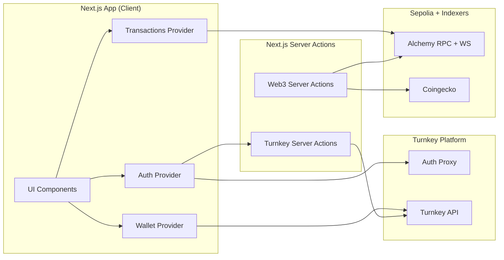
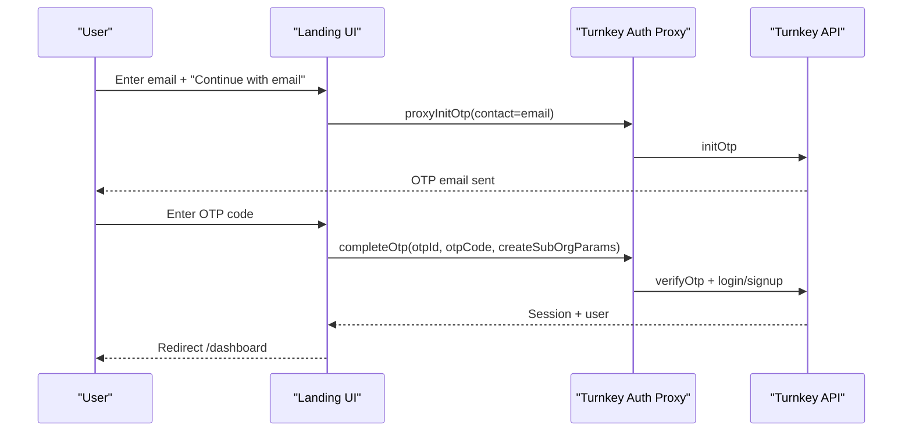
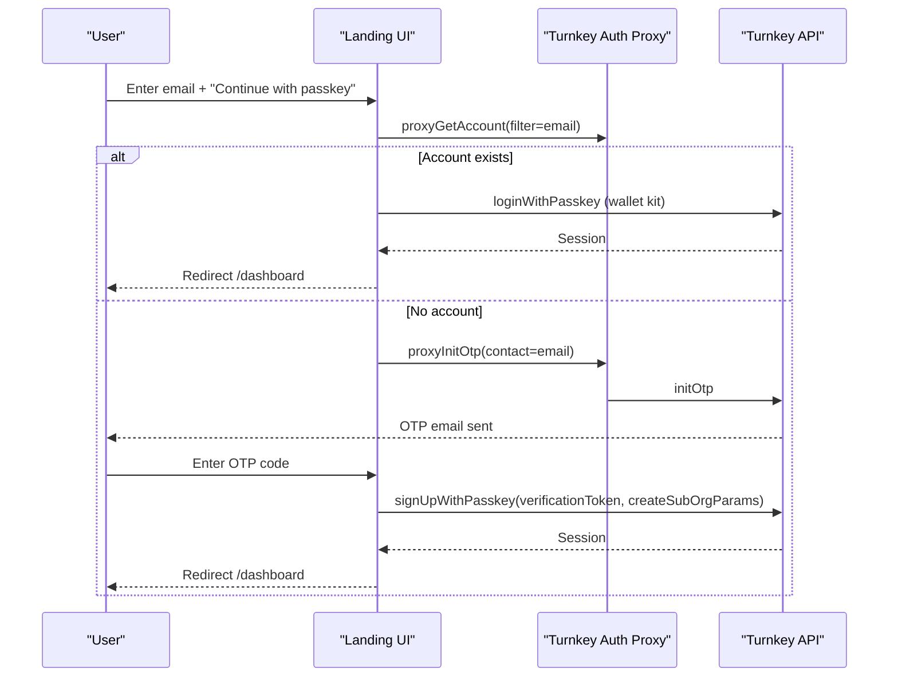
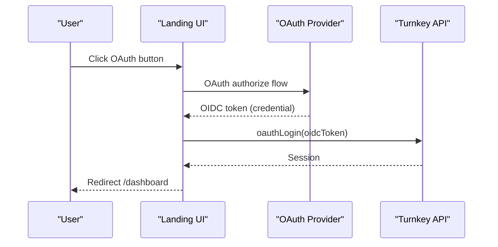
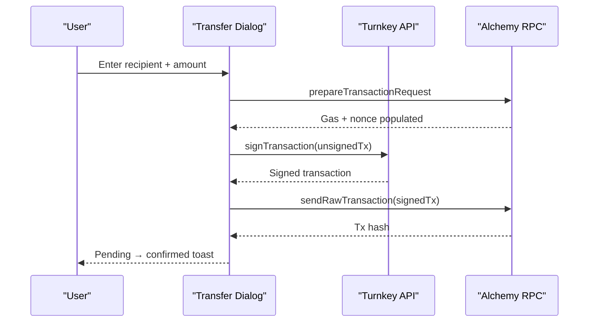
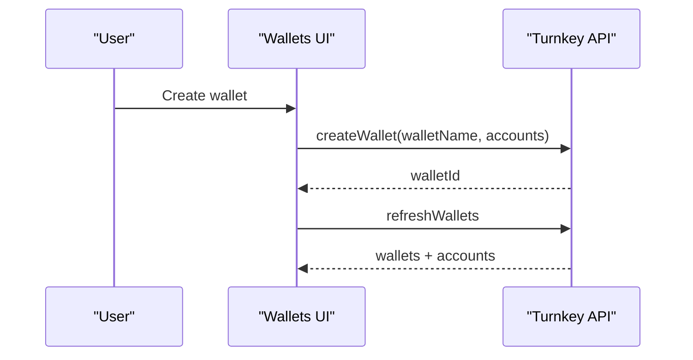
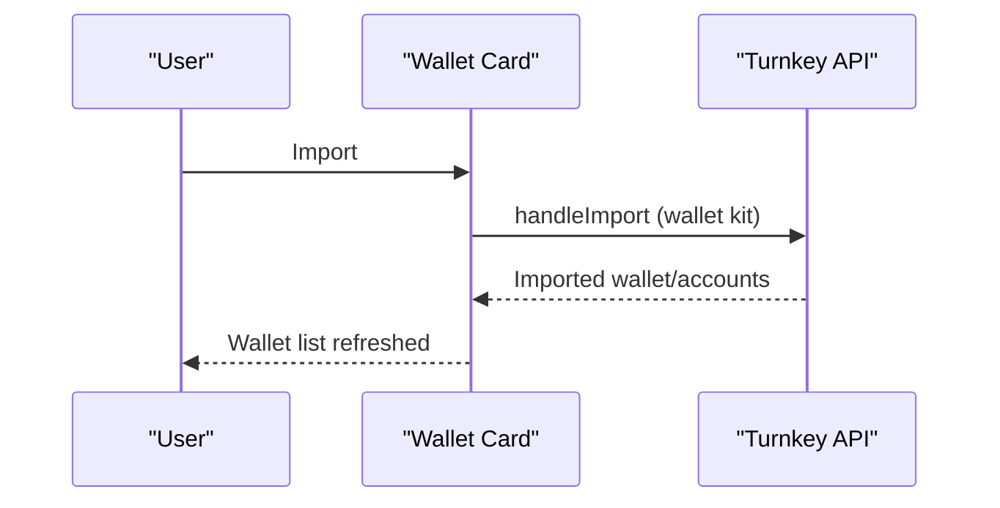
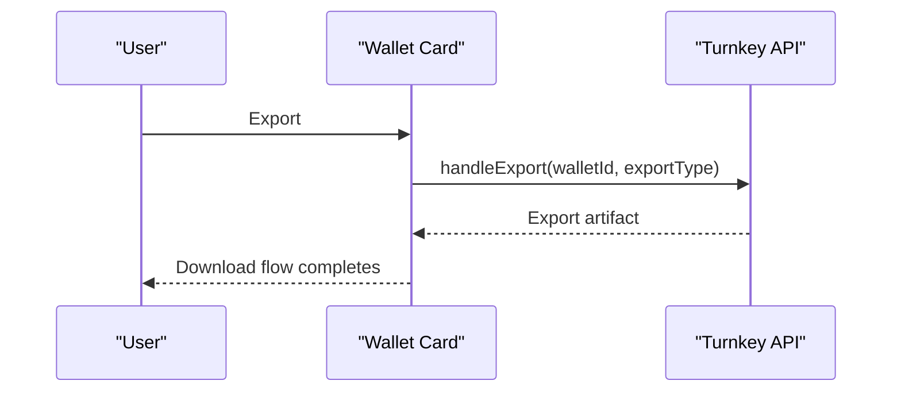

# Demo Embedded Wallet

Turnkey-based embedded wallet demo built with Next.js and Ethereum Sepolia.
This README is written for developers who want to understand the architecture
and fork their own version quickly.

## Table of Contents

- [Quickstart](#quickstart)
- [Configuration](#configuration)
- [Architecture Overview](#architecture-overview)
- [Key Flows (Sequence Diagrams)](#key-flows-sequence-diagrams)
- [Feature Tour (What the App Does)](#feature-tour-what-the-app-does)
- [Turnkey Integration Details](#turnkey-integration-details)
- [Email OTP Flows (Context)](#email-otp-flows-context)
- [Target Network](#target-network)
- [Project Structure](#project-structure)
- [Scripts](#scripts)

## Quickstart

1. Install dependencies

```bash
pnpm install
```

2. Create `.env.local`

```bash
cp .env.example .env.local
```

3. Fill environment variables (see "Configuration" below).
4. Run the app

```bash
pnpm dev
```

## Configuration

Required environment variables live in `.env.example`.

- Turnkey
  - `NEXT_PUBLIC_ORGANIZATION_ID`
  - `NEXT_PUBLIC_AUTH_PROXY_ID`
  - `NEXT_PUBLIC_AUTH_PROXY_URL`
  - `NEXT_PUBLIC_BASE_URL`
- OAuth
  - `NEXT_PUBLIC_GOOGLE_OAUTH_CLIENT_ID`
  - `NEXT_PUBLIC_APPLE_OAUTH_CLIENT_ID`
  - `NEXT_PUBLIC_FACEBOOK_CLIENT_ID`
- Sepolia funding (warchest)
  - `TURNKEY_WARCHEST_ORGANIZATION_ID`
  - `TURNKEY_WARCHEST_API_PUBLIC_KEY`
  - `TURNKEY_WARCHEST_API_PRIVATE_KEY`
  - `WARCHEST_PRIVATE_KEY_ID`
- Web3 + pricing
  - `NEXT_PUBLIC_ALCHEMY_API_KEY`
  - `COINGECKO_API_KEY`

## Architecture Overview


```mermaid
flowchart LR
  subgraph Client["Next.js App (Client)"]
    UI["UI Components"]
    AP["Auth Provider"]
    WP["Wallet Provider"]
    TP["Transactions Provider"]
  end

  subgraph Server["Next.js Server Actions"]
    SA["Turnkey Server Actions"]
    WA["Web3 Server Actions"]
  end

  subgraph Turnkey["Turnkey Platform"]
    TKP["Auth Proxy"]
    TKS["Turnkey API"]
  end

  subgraph Chain["Sepolia + Indexers"]
    RPC["Alchemy RPC + WS"]
    CG["Coingecko"]
  end

  UI --> AP
  UI --> WP
  UI --> TP
  AP --> TKP
  AP --> SA
  WP --> TKS
  TP --> RPC
  SA --> TKS
  WA --> CG
  WA --> RPC
```

## Key Flows (Sequence Diagrams)

### Auth: Email OTP (Auth Proxy)


```mermaid
sequenceDiagram
  participant U as "User"
  participant UI as "Landing UI"
  participant TKP as "Turnkey Auth Proxy"
  participant TK as "Turnkey API"

  U->>UI: Enter email + "Continue with email"
  UI->>TKP: proxyInitOtp(contact=email)
  TKP->>TK: initOtp
  TK-->>U: OTP email sent
  U->>UI: Enter OTP code
  UI->>TKP: completeOtp(otpId, otpCode, createSubOrgParams)
  TKP->>TK: verifyOtp + login/signup
  TK-->>UI: Session + user
  UI-->>U: Redirect /dashboard
```

### Auth: Passkey (Existing vs New)


```mermaid
sequenceDiagram
  participant U as "User"
  participant UI as "Landing UI"
  participant TKP as "Turnkey Auth Proxy"
  participant TK as "Turnkey API"

  U->>UI: Enter email + "Continue with passkey"
  UI->>TKP: proxyGetAccount(filter=email)
  alt Account exists
    UI->>TK: loginWithPasskey (wallet kit)
    TK-->>UI: Session
    UI-->>U: Redirect /dashboard
  else No account
    UI->>TKP: proxyInitOtp(contact=email)
    TKP->>TK: initOtp
    TK-->>U: OTP email sent
    U->>UI: Enter OTP code
    UI->>TK: signUpWithPasskey(verificationToken, createSubOrgParams)
    TK-->>UI: Session
    UI-->>U: Redirect /dashboard
  end
```

### Auth: OAuth (Google/Apple)


```mermaid
sequenceDiagram
  participant U as "User"
  participant UI as "Landing UI"
  participant O as "OAuth Provider"
  participant TK as "Turnkey API"

  U->>UI: Click OAuth button
  UI->>O: OAuth authorize flow
  O-->>UI: OIDC token (credential)
  UI->>TK: oauthLogin(oidcToken)
  TK-->>UI: Session
  UI-->>U: Redirect /dashboard
```

### Signing & Sending ETH


```mermaid
sequenceDiagram
  participant U as "User"
  participant UI as "Transfer Dialog"
  participant TK as "Turnkey API"
  participant RPC as "Alchemy RPC"

  U->>UI: Enter recipient + amount
  UI->>RPC: prepareTransactionRequest
  RPC-->>UI: Gas + nonce populated
  UI->>TK: signTransaction(unsignedTx)
  TK-->>UI: Signed transaction
  UI->>RPC: sendRawTransaction(signedTx)
  RPC-->>UI: Tx hash
  UI-->>U: Pending → confirmed toast
```

### Create Wallet + Account


```mermaid
sequenceDiagram
  participant U as "User"
  participant UI as "Wallets UI"
  participant TK as "Turnkey API"

  U->>UI: Create wallet
  UI->>TK: createWallet(walletName, accounts)
  TK-->>UI: walletId
  UI->>TK: refreshWallets
  TK-->>UI: wallets + accounts
```

### Import Wallet


```mermaid
sequenceDiagram
  participant U as "User"
  participant UI as "Wallet Card"
  participant TK as "Turnkey API"

  U->>UI: Import
  UI->>TK: handleImport (wallet kit)
  TK-->>UI: Imported wallet/accounts
  UI-->>U: Wallet list refreshed
```

### Export Wallet


```mermaid
sequenceDiagram
  participant U as "User"
  participant UI as "Wallet Card"
  participant TK as "Turnkey API"

  U->>UI: Export
  UI->>TK: handleExport(walletId, exportType)
  TK-->>UI: Export artifact
  UI-->>U: Download flow completes
```

## Feature Tour (What the App Does)

### Auth

- Passkey: account lookup via Auth Proxy and passkey login or passkey signup.
- Email OTP (proxy): OTP initiation and login/signup via Auth Proxy.
- OAuth: Google/Apple via wallet kit helpers; Facebook via callback exchange.
- Wallet login: Turnkey wallet kit `loginOrSignupWithWallet`.

### Wallets & Accounts

- Wallets are loaded and normalized in `src/providers/wallet-provider.tsx`.
- Create wallet/accounts using `createWallet` and `createWalletAccounts`.
- Preferred wallet selection is stored in localStorage.

### Faucet (Add funds)

- UI calls `fundWallet` in `src/lib/web3.ts`.
- Server action uses a separate Turnkey "warchest" org to send 0.001 ETH.
- Faucet is gated by a "received at least 1 tx" check via Alchemy.

### Sending Funds

- Transaction prepared with a Turnkey-backed viem wallet client.
- Signing via Turnkey `signTransaction`, broadcast via Alchemy RPC.

### Receiving Funds

- Receive tab shows QR code and address for the selected account.

### Activity & Assets

- Transactions fetched and watched via Alchemy websocket.
- ETH price fetched from Coingecko for USD display.

## Turnkey Integration Details

- Provider config: `src/config/turnkey.ts` via `TurnkeyProvider` in
  `src/providers/index.tsx`.
- Client SDK usage:
  - `@turnkey/react-wallet-kit`: auth flows, wallet management, signing.
  - `@turnkey/sdk-react`: custom auth/session handling.
- Server SDK usage:
  - `@turnkey/sdk-server` + `ApiKeyStamper` for sub-org creation, OTP login,
    and the warchest faucet.
- viem bridge:
  - `@turnkey/viem` creates a viem `WalletClient` bound to Turnkey signing.

## Turnkey Troubleshooting

- Auth Proxy misconfig
  - Symptoms: OTP init/verify fails, OAuth returns generic errors.
  - Check `NEXT_PUBLIC_AUTH_PROXY_ID` and `NEXT_PUBLIC_AUTH_PROXY_URL` in
    `.env.local`, and ensure they match the proxy config used in
    `src/config/turnkey.ts`.
- OAuth redirect mismatch
  - Symptoms: Google/Apple/Facebook login redirects with provider errors.
  - Fix: Verify the OAuth provider's redirect URI matches your app URL and the
    configured `NEXT_PUBLIC_APP_URL`.
- Passkey registration/login fails
  - Symptoms: NotAllowedError or "Invalid state" in passkey flows.
  - Fix: Ensure `NEXT_PUBLIC_RP_ID` matches your deployment domain and that
    you are using HTTPS in production. Localhost works without a custom RP ID.
- Server actions failing (Turnkey API keys)
  - Symptoms: 401/403 or "signature invalid" during sub-org creation or OTP.
  - Fix: Validate `TURNKEY_API_PUBLIC_KEY`, `TURNKEY_API_PRIVATE_KEY`, and
    `NEXT_PUBLIC_ORGANIZATION_ID` match the same org. See `src/actions/turnkey.ts`.
- Faucet (warchest) not funding
  - Symptoms: "unable to drip" or funding errors.
  - Fix: Ensure the warchest org is funded and all warchest env vars are set:
    `TURNKEY_WARCHEST_*` and `WARCHEST_PRIVATE_KEY_ID`.
- Alchemy or price data errors
  - Symptoms: zero balances, failed tx fetches, missing USD price.
  - Fix: Confirm `NEXT_PUBLIC_ALCHEMY_API_KEY` and `COINGECKO_API_KEY` are valid.

## Email OTP Flows (Context)

Two email OTP approaches exist, but only one is actively used by the UI.
The proxy OTP flow is the current implementation; the magic link flow is kept
as a reference and is not invoked by the landing auth UI.

- Proxy OTP flow (wallet kit)
  - `src/components/auth.tsx`
  - `src/app/(landing)/verify-email/page.tsx`
- Magic link flow (custom server actions)
  - `src/providers/auth-provider.tsx`
  - `src/app/(landing)/email-auth/page.tsx`

## Target Network

This demo targets Ethereum Sepolia only.

If you want to swap networks, update:
- `src/lib/web3.ts`: `alchemyRpcUrl`, `Network.ETH_SEPOLIA`, `sepolia`
- `src/actions/web3.ts`: `Network.ETH_SEPOLIA`
- UI copy that mentions Sepolia

## Project Structure

- `src/app/(landing)`: unauthenticated landing + auth routes
- `src/app/(dashboard)`: authenticated wallet views
- `src/components`: feature UI (auth, wallet, transfers, activity)
- `src/providers`: Turnkey, auth, wallet, and transactions state
- `src/actions`: server actions for Turnkey + web3
- `src/lib`: web3 clients and shared utilities

## Scripts

1. Check project formatting

```bash
pnpm format:check
```

2. Format the project

```bash
pnpm format
```
