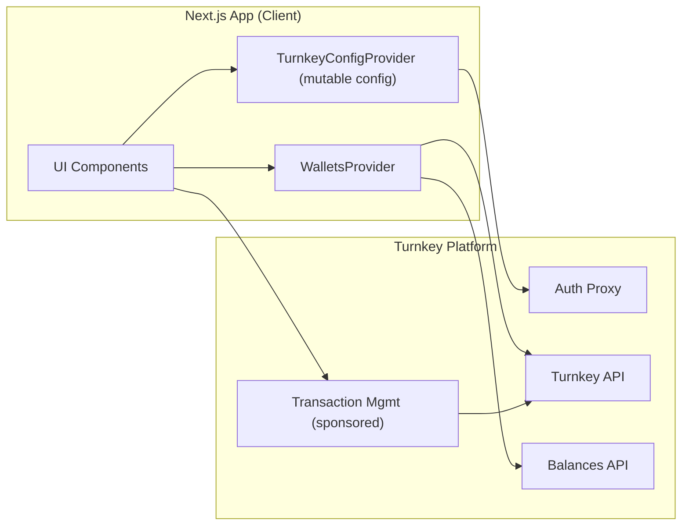
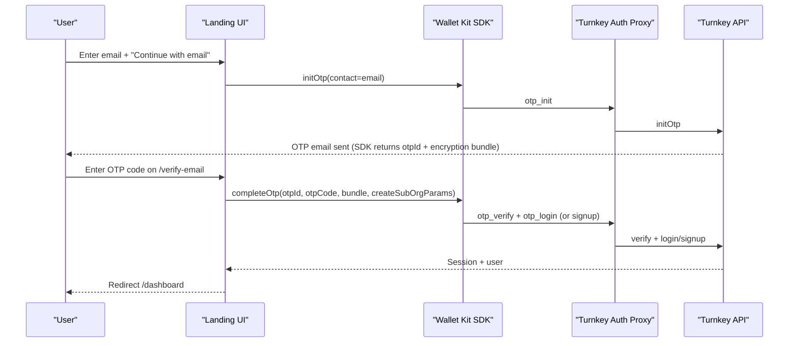
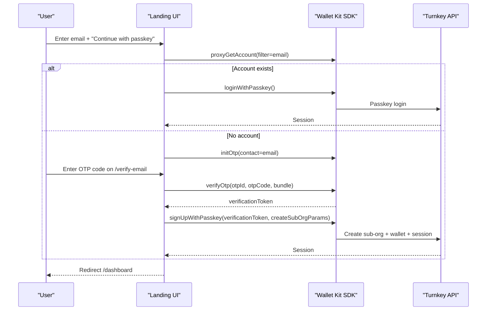
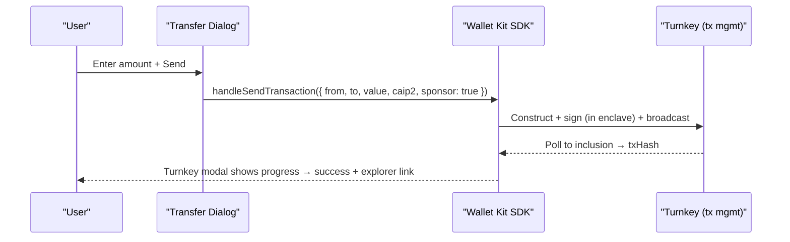

# Demo Embedded Wallet

Turnkey-based embedded wallet demo built with Next.js and Ethereum Sepolia.
This README is written for developers who want to understand the architecture
and fork their own version quickly.

The app is **backendless**: authentication, wallet management, balances, and
transactions all run client-side against Turnkey's [Embedded Wallet Kit
(`@turnkey/react-wallet-kit`)](https://docs.turnkey.com/sdks/react) and the
managed [Auth Proxy](https://docs.turnkey.com/features/authentication/auth-proxy).
Sending is done with Turnkey's [transaction management](https://docs.turnkey.com/features/transaction-management)
(gas-sponsored), and balances come from Turnkey's [Balances API](https://docs.turnkey.com/features/transaction-management/balances).
There are no server actions, no third-party RPC/indexer, and no server API keys.

## Table of Contents

- [Quickstart](#quickstart)
- [Configuration](#configuration)
- [Architecture Overview](#architecture-overview)
- [Key Flows (Sequence Diagrams)](#key-flows-sequence-diagrams)
- [Feature Tour (What the App Does)](#feature-tour-what-the-app-does)
- [Developer Mode](#developer-mode)
- [Turnkey Integration Details](#turnkey-integration-details)
- [Troubleshooting](#troubleshooting)
- [Target Network](#target-network)
- [Project Structure](#project-structure)
- [Scripts](#scripts)

## Quickstart

1. Install dependencies

```bash
pnpm install
```

2. Enable the Auth Proxy in the Turnkey dashboard (**Embedded Wallets →
   Configuration**), choose the auth methods you want (email OTP, passkey,
   OAuth, external wallet), set OAuth client IDs + redirect URL there, and copy
   your **Organization ID** and **Auth Proxy Config ID**. To use gas-sponsored
   sends, also enable **Gas Sponsorship** for the org.

3. Create `.env.local`

```bash
cp .env.example .env.local
```

4. Fill the two required variables (see [Configuration](#configuration)).
5. Run the app

```bash
pnpm dev
```

## Configuration

Environment variables are validated at startup via `@t3-oss/env-nextjs` in
`src/env.mjs`. Set `SKIP_ENV_VALIDATION=1` to bypass validation for local
builds (`pnpm build:local`).

Because the app is backendless and the Auth Proxy serves auth configuration
(enabled methods, OAuth client IDs, redirect URL, session length, OTP settings)
from the dashboard, the app only needs two variables:

### Required

| Variable | Description |
|---|---|
| `NEXT_PUBLIC_ORGANIZATION_ID` | Your Turnkey parent organization ID |
| `NEXT_PUBLIC_AUTH_PROXY_ID` | Auth Proxy config ID (dashboard → Embedded Wallets → Configuration) |

### Optional

| Variable | Description |
|---|---|
| `NEXT_PUBLIC_BASE_URL` | Turnkey API base URL (defaults to `https://api.turnkey.com`) |
| `NEXT_PUBLIC_AUTH_PROXY_URL` | Auth Proxy endpoint (defaults to `https://authproxy.turnkey.com`) |

Everything else — which auth methods appear, OAuth client IDs, OAuth redirect
URL, session expiration, OTP length/type, email branding — is configured on the
Turnkey dashboard and fetched by the SDK via the Auth Proxy's
`wallet_kit_config`. See [Developer Mode](#developer-mode) for overriding the
presentation of these at runtime.

## Architecture Overview


```mermaid
flowchart LR
  subgraph Client["Next.js App (Client)"]
    UI["UI Components"]
    CP["TurnkeyConfigProvider (mutable config)"]
    WP["WalletsProvider"]
  end

  subgraph Turnkey["Turnkey Platform"]
    TKP["Auth Proxy"]
    TKS["Turnkey API"]
    BAL["Balances API"]
    TX["Transaction Mgmt (sponsored)"]
  end

  UI --> CP
  UI --> WP
  CP --> TKP
  WP --> TKS
  WP --> BAL
  UI --> TX
  TX --> TKS
```

There is no application backend. Auth, signing, balances, and broadcasting all
go directly from the client to Turnkey (the user's session stamps requests).

### Provider Hierarchy

Root layout (`src/providers/index.tsx`):

```
ThemeProvider (next-themes, forced light)
  └─ TurnkeyConfigProvider (holds a mutable TurnkeyProviderConfig)
      └─ TurnkeyProvider (@turnkey/react-wallet-kit)
```

Dashboard layout (`src/app/(dashboard)/layout.tsx`) adds:

```
AuthGuard
  └─ WalletsProvider (wallet/account selection, creation, balance caching)
      └─ NavMenu + page content
```

`WalletsProvider` uses the `useTurnkey()` hook to read wallets from the Turnkey
session (normalized into typed `Wallet[]` with checksummed addresses) and
fetches per-account balances from Turnkey's Balances API. The
`TurnkeyConfigProvider` owns the config passed to `TurnkeyProvider`; the
[Developer Mode](#developer-mode) panel mutates that config at runtime.

## Key Flows (Sequence Diagrams)

### Auth: Email OTP (Auth Proxy)


```mermaid
sequenceDiagram
  participant U as "User"
  participant UI as "Landing UI"
  participant SDK as "Wallet Kit SDK"
  participant TKP as "Turnkey Auth Proxy"
  participant TK as "Turnkey API"

  U->>UI: Enter email + "Continue with email"
  UI->>SDK: initOtp(contact=email)
  SDK->>TKP: otp_init
  TKP->>TK: initOtp
  TK-->>U: OTP email sent (SDK returns otpId + encryption bundle)
  U->>UI: Enter OTP code on /verify-email
  UI->>SDK: completeOtp(otpId, otpCode, bundle, createSubOrgParams)
  SDK->>TKP: otp_verify + otp_login (or signup)
  TKP->>TK: verify + login/signup
  TK-->>UI: Session + user
  UI-->>U: Redirect /dashboard
```

Note: `@turnkey/react-wallet-kit` v2 returns an `otpEncryptionTargetBundle` from
`initOtp` that must be passed to `verifyOtp`/`completeOtp`. The app stashes it
in `sessionStorage` (keyed by `otpId`) between the landing page and
`/verify-email`.

### Auth: Passkey


```mermaid
sequenceDiagram
  participant U as "User"
  participant UI as "Landing UI"
  participant SDK as "Wallet Kit SDK"
  participant TK as "Turnkey API"

  U->>UI: Enter email + "Continue with passkey"
  UI->>SDK: proxyGetAccount(filter=email)
  alt Account exists
    UI->>SDK: loginWithPasskey()
    SDK->>TK: Passkey login
    TK-->>UI: Session
  else No account
    UI->>SDK: initOtp(contact=email)
    U->>UI: Enter OTP code on /verify-email
    UI->>SDK: verifyOtp(otpId, otpCode, bundle)
    SDK-->>UI: verificationToken
    UI->>SDK: signUpWithPasskey(verificationToken, createSubOrgParams)
    SDK->>TK: Create sub-org + wallet + session
    TK-->>UI: Session
  end
  UI-->>U: Redirect /dashboard
```

### Auth: OAuth & External Wallet

Google, Apple, Facebook, and external wallets are handled entirely by
`@turnkey/react-wallet-kit` (`handleGoogleOauth()`, `handleAppleOauth()`,
`handleFacebookOauth()`, `loginOrSignupWithWallet()`). The SDK manages the OIDC
/ wallet flow, sub-org creation, redirect completion, and session — no custom
callback pages or server actions. OAuth client IDs and the redirect URL come
from the Auth Proxy dashboard config.

### Signing & Sending ETH (sponsored)


```mermaid
sequenceDiagram
  participant U as "User"
  participant UI as "Transfer Dialog"
  participant SDK as "Wallet Kit SDK"
  participant TK as "Turnkey (tx mgmt)"

  U->>UI: Enter amount + Send
  UI->>SDK: handleSendTransaction({ from, to, value, caip2, sponsor: true })
  SDK->>TK: Construct + sign (in enclave) + broadcast
  TK-->>SDK: Poll to inclusion → txHash
  SDK-->>U: Turnkey modal shows progress → success + explorer link
```

Turnkey fills nonce/gas, signs in-enclave, broadcasts, and polls to inclusion.
With `sponsor: true`, the user pays no gas.

### Create Wallet + Account / Import / Export

Handled by wallet kit hooks: `createWallet` / `createWalletAccounts`,
`handleImportWallet`, `handleExportWallet` (each opens the appropriate modal /
iframe flow).

## Feature Tour (What the App Does)

### Auth

- **Passkey**: account lookup via Auth Proxy (`proxyGetAccount`). Existing users
  log in directly; new users verify email via OTP, then sign up with a passkey
  (sub-org + wallet created automatically).
- **Email OTP**: `initOtp` → `/verify-email` → `completeOtp` (verify + login /
  signup in one call).
- **OAuth**: Google, Apple, Facebook via wallet kit `handle*Oauth()` — redirect
  completion is automatic.
- **External wallet**: `loginOrSignupWithWallet()` with a provider picker
  (Solana providers filtered out).

### Wallets & Accounts

- Wallets loaded from the Turnkey session and normalized (valid, checksummed
  Ethereum addresses) in `src/providers/wallet-provider.tsx`.
- Create wallets (`createWallet`) or add accounts (`createWalletAccounts`) via
  wallet kit hooks. Preferred wallet persisted to localStorage per user.
- Balances fetched from Turnkey's Balances API (`getWalletAddressBalances`,
  `caip2: eip155:11155111`) with an in-memory cache. The native ETH balance is
  surfaced as wei; the full asset list (with `display.usd`) is kept for the
  assets table. ETH/USD for display is derived from the balance's `display`
  fields (no third-party price feed).

### Sending Funds

- Transfer dialog (`src/components/transfer-dialog.tsx`) with Send/Receive tabs
  (a drawer on mobile).
- Send uses `handleSendTransaction` with `sponsor: true` — Turnkey handles
  construction, signing, broadcast, polling, and shows its own progress/success
  modal with an explorer link. No viem, no third-party RPC.

### Receiving Funds

- Receive tab shows a QR code (`react-qr-code`) and the checksummed address with
  copy-to-clipboard.

### Assets

- Assets table shows the ETH balance and USD value sourced from the Turnkey
  Balances API.

### Session Management

- Auto session refresh (`auth.autoRefreshSession`). On full expiry the
  `onSessionExpired` callback returns the user to the landing page.

### Passkey Management

- `/settings` lists passkeys with creation date and credential ID; users can add
  or remove passkeys (removal disabled when only one remains).

## Developer Mode

The app ships a runtime config panel modeled on the
[`wallets.turnkey.com`](https://wallets.turnkey.com) reference demo, gated behind
a **Developer Mode** so regular users never see it.

- Enable it by appending `?dev` to any URL (persisted in `localStorage` under
  `tk-dev-mode`). A floating gear button appears bottom-right.
- The panel (`src/components/dev-config-panel.tsx`) mutates the live
  `TurnkeyProviderConfig` held by `TurnkeyConfigProvider`
  (`src/providers/config/config-provider.tsx`): toggle which auth methods appear
  in the login modal (`ui.authModal.methods`), dark mode, and border radius.
  Changes apply immediately (the Turnkey client re-initializes; sessions
  persist).
- These are presentation overrides on top of the Auth-Proxy-backed config — the
  architecture is identical to production; only the config source differs.

## Turnkey Integration Details

### Provider config

`src/config/turnkey.ts` defines the static `TurnkeyProviderConfig`:
- Organization ID + Auth Proxy config ID (+ optional API/proxy URL overrides)
- `auth.autoRefreshSession` and `createSuborgParams` per method, each creating a
  default Ethereum wallet (`m/44'/60'/0'/0/0`)
- A `ui` block (dark mode, border radius) used as the Developer Mode panel's
  starting state

OAuth client IDs, the redirect URL, and enabled auth methods are intentionally
**not** in code — they live in the dashboard and are served via the Auth Proxy.

### SDK packages

| Package | Usage |
|---|---|
| `@turnkey/react-wallet-kit` (v2) | `TurnkeyProvider`, `useTurnkey()` for auth, wallet CRUD, balances (`getWalletAddressBalances`), signing/sending (`handleSendTransaction`), import/export |
| `@turnkey/http` | Type imports (`TurnkeyApiTypes`) used in `src/types/turnkey.ts` |

## Troubleshooting

- **Auth Proxy misconfig** — OTP/OAuth fails or the login modal is empty. Ensure
  the Auth Proxy is enabled and the desired methods/OAuth client IDs/redirect
  URL are configured in the dashboard, and that `NEXT_PUBLIC_AUTH_PROXY_ID`
  matches.
- **OAuth redirect mismatch** — verify the provider's redirect URI matches the
  redirect URL configured in the dashboard Auth Proxy config.
- **Passkey registration/login fails** — ensure your deployment domain is used
  as the RP ID (localhost works in dev) and HTTPS in production.
- **Sponsored send fails / "gas sponsorship not enabled"** — enable Gas
  Sponsorship for the org in the dashboard. Sends target Sepolia
  (`eip155:11155111`).
- **Balances show 0** — the Balances API returns non-zero balances only for
  supported assets on the queried chain; on testnets `display.usd` may be 0.

## Target Network

This demo targets Ethereum Sepolia (`eip155:11155111`). To swap networks, update
the `caip2` constants in `src/providers/wallet-provider.tsx` and
`src/components/transfer-dialog.tsx` (and `customWallet` in
`src/config/turnkey.ts` for non-EVM curves), plus any UI copy mentioning Sepolia.

## Project Structure

```
src/
├── app/
│   ├── layout.tsx                     # Root layout (metadata, Providers wrapper)
│   ├── (landing)/                     # Unauthenticated routes (InverseAuthGuard)
│   │   ├── page.tsx                   # Landing page with Auth component
│   │   ├── layout.tsx                 # Landing layout (features sidebar, toaster)
│   │   └── verify-email/              # Email OTP verification
│   └── (dashboard)/                   # Authenticated routes (AuthGuard)
│       ├── layout.tsx                 # Dashboard layout (WalletsProvider, nav)
│       ├── dashboard/page.tsx         # Wallet card + assets table
│       └── settings/page.tsx          # Passkey management
├── components/
│   ├── auth.tsx                       # Main auth form (email/passkey/wallet/OAuth)
│   ├── google-auth.tsx / apple-auth.tsx / facebook-auth.tsx  # OAuth buttons
│   ├── wallet-card.tsx                # Wallet display (balance, transfer, import/export)
│   ├── assets.tsx                     # ETH balance table with USD value
│   ├── transfer-dialog.tsx            # Send/receive dialog (sponsored send)
│   ├── recipient-address.tsx          # Recipient address field
│   ├── value-input.tsx                # ETH amount input
│   ├── passkeys.tsx / add-passkey.tsx / passkey-item.tsx     # Passkey management
│   ├── auth-guard.tsx                 # Route protection (AuthGuard + InverseAuthGuard)
│   ├── nav-menu.tsx / account.tsx     # Navigation + account dropdown
│   ├── dev-config-panel.tsx           # Developer Mode config panel (DevTools)
│   ├── mode-toggle.tsx / features.tsx / icons.tsx
│   └── ui/                            # shadcn/ui primitives
├── config/
│   ├── turnkey.ts                     # TurnkeyProviderConfig (static defaults)
│   └── site.ts                        # Site metadata and base URL detection
├── providers/
│   ├── index.tsx                      # Root provider hierarchy (Theme > TurnkeyConfig)
│   ├── theme-provider.tsx             # next-themes wrapper
│   ├── config/config-provider.tsx     # Mutable config + owns TurnkeyProvider + Dev Mode
│   └── wallet-provider.tsx            # Wallet/account CRUD, selection, Turnkey balances
├── hooks/
│   └── use-token-price.tsx            # ETH/USD derived from Turnkey balance display
├── lib/
│   ├── utils.ts                       # cn(), truncateAddress(), getRpId()
│   └── constants.ts                   # Curve types, localStorage keys
├── types/
│   ├── turnkey.ts                     # Account, Wallet, AssetBalance, ... types
│   └── index.d.ts                     # Global type declarations
├── styles/
│   └── globals.css                    # Tailwind CSS base styles
└── env.mjs                            # Type-safe env var validation (t3-env)
```

## Scripts

| Command | Description |
|---|---|
| `pnpm dev` | Start Next.js development server |
| `pnpm build` | Production build (validates env vars) |
| `pnpm build:local` | Production build with `SKIP_ENV_VALIDATION=1` |
| `pnpm start` | Start production server |
| `pnpm lint` | Run ESLint |
| `pnpm format` | Format code with Prettier |
| `pnpm format:check` | Check formatting without writing |
```
