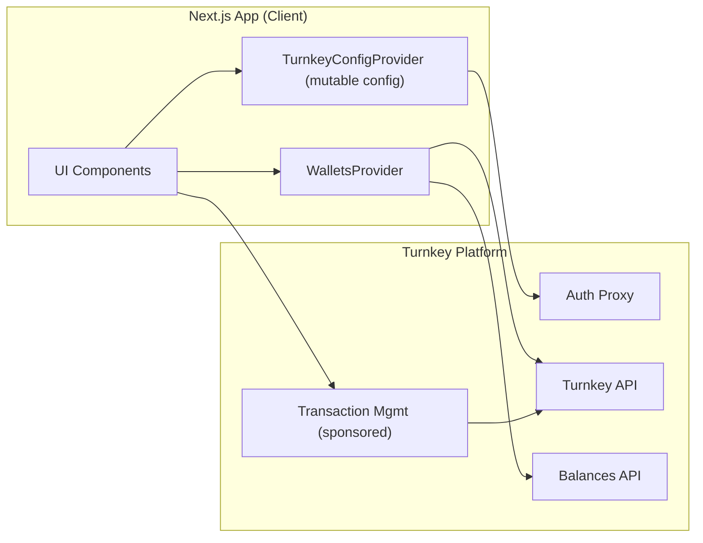
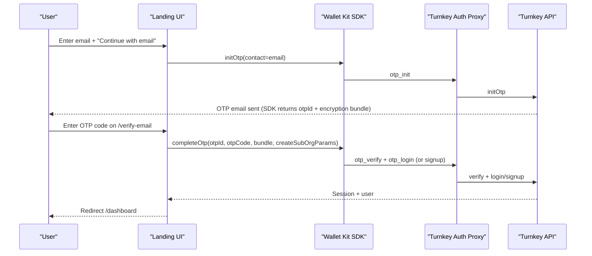
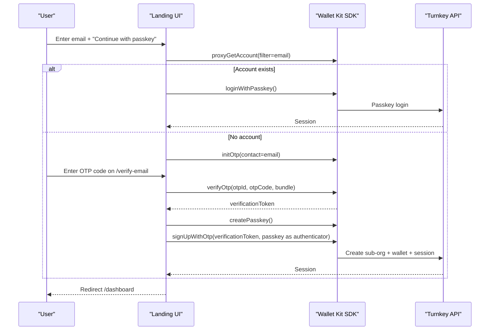
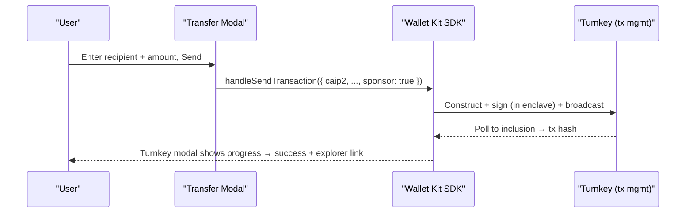

# Demo Embedded Wallet

Turnkey-based embedded wallet demo built with Next.js. It supports Ethereum,
Base, and Solana, on mainnet or testnet. This README is written for developers
who want to understand the architecture and fork their own version quickly.

The app is **backendless**: authentication, wallet management, balances, and
transactions all run client-side against Turnkey's [Embedded Wallet Kit
(`@turnkey/react-wallet-kit`)](https://docs.turnkey.com/sdks/react) and the
managed [Auth Proxy](https://docs.turnkey.com/features/authentication/auth-proxy).
Sending is done with Turnkey's [transaction management](https://docs.turnkey.com/features/transaction-management)
(gas-sponsored), and balances come from Turnkey's [Balances API](https://docs.turnkey.com/features/transaction-management/balances).
There are no server actions, no third-party RPC/indexer, and no server API keys.

## Table of Contents

- [Quickstart](#quickstart)
- [Configuration](#configuration)
- [Architecture Overview](#architecture-overview)
- [Key Flows (Sequence Diagrams)](#key-flows-sequence-diagrams)
- [Feature Tour (What the App Does)](#feature-tour-what-the-app-does)
- [Co-signing and Policies](#co-signing-and-policies)
- [Config Panel](#config-panel)
- [Turnkey Integration Details](#turnkey-integration-details)
- [Troubleshooting](#troubleshooting)
- [Networks](#networks)
- [Project Structure](#project-structure)
- [Scripts](#scripts)

## Quickstart

1. Install dependencies

```bash
pnpm install
```

2. Enable the Auth Proxy in the Turnkey dashboard (**Embedded Wallets →
   Configuration**), choose the auth methods you want (email OTP, passkey,
   OAuth, external wallet), set OAuth client IDs + redirect URL there, and copy
   your **Organization ID** and **Auth Proxy Config ID**. To use gas-sponsored
   sends, also enable **Gas Sponsorship** for the org.

3. Create `.env.local`

```bash
cp .env.example .env.local
```

4. Fill the two required variables (see [Configuration](#configuration)).
5. Run the app

```bash
pnpm dev
```

## Configuration

Environment variables are validated at startup via `@t3-oss/env-nextjs` in
`src/env.mjs`. Empty values are treated as unset. Set `SKIP_ENV_VALIDATION=1`
to bypass validation for local builds (`pnpm build:local`).

Because the app is backendless and the Auth Proxy serves auth configuration
(enabled methods, OAuth client IDs, redirect URL, session length, OTP settings)
from the dashboard, the app only needs two variables:

### Required

| Variable                      | Description                                                         |
| ----------------------------- | ------------------------------------------------------------------- |
| `NEXT_PUBLIC_ORGANIZATION_ID` | Your Turnkey parent organization ID                                 |
| `NEXT_PUBLIC_AUTH_PROXY_ID`   | Auth Proxy config ID (dashboard → Embedded Wallets → Configuration) |

### Optional

| Variable                                | Description                                                                                                                   |
| --------------------------------------- | ----------------------------------------------------------------------------------------------------------------------------- |
| `NEXT_PUBLIC_BASE_URL`                  | Turnkey API base URL (defaults to `https://api.turnkey.com`)                                                                  |
| `NEXT_PUBLIC_AUTH_PROXY_URL`            | Auth Proxy endpoint (defaults to `https://authproxy.turnkey.com`)                                                             |
| `NEXT_PUBLIC_OAUTH_REDIRECT_URI`        | Overrides the dashboard's OAuth redirect URL for every provider. Use it for local dev (e.g. `http://localhost:3000/`)         |
| `NEXT_PUBLIC_POLICY_MANAGER_PUBLIC_KEY` | Public key of the Policy Manager API key, used for [co-signing](#co-signing-and-policies). Without it, co-signing setup fails |

### Policy admin CLI only

These are read only by `scripts/policy-admin.ts`. Never give them a
`NEXT_PUBLIC_` prefix and don't add them to the web deployment.

| Variable                             | Description                                                              |
| ------------------------------------ | ------------------------------------------------------------------------ |
| `TURNKEY_POLICY_MANAGER_PRIVATE_KEY` | Private half of the Policy Manager key. A root user of every sub-org     |
| `TURNKEY_SUBORG_ID`                  | Default sub-org the CLI operates on (override per run with `--org <id>`) |

Everything else — which auth methods appear, OAuth client IDs, OAuth redirect
URL, session expiration, OTP length/type, email branding — is configured on the
Turnkey dashboard and fetched by the SDK via the Auth Proxy's
`wallet_kit_config`. See [Config Panel](#config-panel) for overriding the
presentation of these at runtime.

### Dashboard setting: account lookups

The passkey sign-in flow calls `proxyGetAccount` to check whether an account
already exists for the entered email, so it can route to login vs. sign-up
before the user authenticates. For that pre-login lookup to succeed, disable
**Require token for account lookups** in the Auth Proxy configuration (dashboard
→ Embedded Wallets → Configuration).

With that setting off, account-existence lookups are unauthenticated (an email
can be probed for whether it has an account). That is acceptable for a demo; a
production app should leave the setting enabled and route login vs. sign-up with
an authenticated lookup (e.g. server-side, or after an OTP verification token is
obtained).

## Architecture Overview


```mermaid
flowchart LR
  subgraph Client["Next.js App (Client)"]
    UI["UI Components"]
    CP["TurnkeyConfigProvider (mutable config)"]
    WP["WalletsProvider"]
  end

  subgraph Turnkey["Turnkey Platform"]
    TKP["Auth Proxy"]
    TKS["Turnkey API"]
    BAL["Balances API"]
    TX["Transaction Mgmt (sponsored)"]
  end

  UI --> CP
  UI --> WP
  CP --> TKP
  WP --> TKS
  WP --> BAL
  UI --> TX
  TX --> TKS
```

There is no application backend. Auth, signing, balances, and broadcasting all
go directly from the client to Turnkey (the user's session stamps requests).
The only other outbound call is Coinbase's public spot-price endpoint, used to
put a USD value on testnet balances.

### Provider Hierarchy

Root layout (`src/providers/index.tsx`):

```
ThemeProvider (next-themes, forced light)
  └─ TurnkeyConfigProvider (holds a mutable TurnkeyProviderConfig)
      └─ TurnkeyProvider (@turnkey/react-wallet-kit) + Config Panel
```

Dashboard layout (`src/app/(dashboard)/layout.tsx`) adds:

```
AuthGuard
  └─ WalletsProvider (wallets, HD account selection, network mode, balances)
      └─ RwkRejectionGuard + ProvisionOnSignup + NavMenu + page content
```

`WalletsProvider` uses the `useTurnkey()` hook to read wallets from the Turnkey
session and fetches per-chain balances from Turnkey's Balances API. The
`TurnkeyConfigProvider` owns the config passed to `TurnkeyProvider`; the
[Config Panel](#config-panel) mutates that config at runtime.

`AuthGuard` waits for the Turnkey client to finish restoring the stored session
before deciding to redirect, so refreshing a dashboard page keeps you on it.

## Key Flows (Sequence Diagrams)

### Auth: Email OTP (Auth Proxy)


```mermaid
sequenceDiagram
  participant U as "User"
  participant UI as "Landing UI"
  participant SDK as "Wallet Kit SDK"
  participant TKP as "Turnkey Auth Proxy"
  participant TK as "Turnkey API"

  U->>UI: Enter email + "Continue with email"
  UI->>SDK: initOtp(contact=email)
  SDK->>TKP: otp_init
  TKP->>TK: initOtp
  TK-->>U: OTP email sent (SDK returns otpId + encryption bundle)
  U->>UI: Enter OTP code on /verify-email
  UI->>SDK: completeOtp(otpId, otpCode, bundle, createSubOrgParams)
  SDK->>TKP: otp_verify + otp_login (or signup)
  TKP->>TK: verify + login/signup
  TK-->>UI: Session + user
  UI-->>U: Redirect /dashboard
```

Note: `@turnkey/react-wallet-kit` v2 returns an `otpEncryptionTargetBundle` from
`initOtp` that must be passed to `verifyOtp`/`completeOtp`. The app stashes it
in `sessionStorage` (keyed by `otpId`) between the landing page and
`/verify-email`.

### Auth: Passkey


```mermaid
sequenceDiagram
  participant U as "User"
  participant UI as "Landing UI"
  participant SDK as "Wallet Kit SDK"
  participant TK as "Turnkey API"

  U->>UI: Enter email + "Continue with passkey"
  UI->>SDK: proxyGetAccount(filter=email)
  alt Account exists
    UI->>SDK: loginWithPasskey()
    SDK->>TK: Passkey login
    TK-->>UI: Session
  else No account
    UI->>SDK: initOtp(contact=email)
    U->>UI: Enter OTP code on /verify-email
    UI->>SDK: verifyOtp(otpId, otpCode, bundle)
    SDK-->>UI: verificationToken
    UI->>SDK: createPasskey()
    UI->>SDK: signUpWithOtp(verificationToken, passkey as authenticator)
    SDK->>TK: Create sub-org + wallet + session
    TK-->>UI: Session
  end
  UI-->>U: Redirect /dashboard
```

Passkey sign-up goes through `signUpWithOtp` with the new passkey attached as
the authenticator, so the request carries the verified email's OTP client
signature.

### Auth: OAuth & External Wallet

Google, Apple, Facebook, and external wallets are handled entirely by
`@turnkey/react-wallet-kit` (`handleGoogleOauth()`, `handleAppleOauth()`,
`handleFacebookOauth()`, `loginOrSignupWithWallet()`). OAuth runs as an in-page
redirect (`openInPage: true`). The SDK manages the OIDC / wallet flow, sub-org
creation, redirect completion, and session — no custom callback pages or server
actions. OAuth client IDs and the redirect URL come from the Auth Proxy
dashboard config.

Each authenticator identifies its own sub-org. Signing in with the same email
through two different methods (e.g. Google and email OTP) creates two separate
accounts.

### Sending (sponsored)


```mermaid
sequenceDiagram
  participant U as "User"
  participant UI as "Transfer Modal"
  participant SDK as "Wallet Kit SDK"
  participant TK as "Turnkey (tx mgmt)"

  U->>UI: Enter recipient + amount, Send
  UI->>SDK: handleSendTransaction({ caip2, ..., sponsor: true })
  SDK->>TK: Construct + sign (in enclave) + broadcast
  TK-->>SDK: Poll to inclusion → tx hash
  SDK-->>U: Turnkey modal shows progress → success + explorer link
```

Turnkey fills nonce/gas, signs in-enclave, broadcasts, and polls to inclusion.
With `sponsor: true`, the user pays no gas. ERC-20 transfers send calldata built
in `src/lib/evm.ts`; Solana transfers are built in `src/lib/solana.ts` without an
RPC (Turnkey fills the blockhash and fees at broadcast).

If a send isn't allowed by the sub-org's policies at 2/2, it escalates to the
Policy Manager for co-signature instead of being rejected (see
[Co-signing and Policies](#co-signing-and-policies)).

### Create Wallet + Account / Import / Export

Handled by wallet kit hooks: `createWallet` / `createWalletAccounts`,
`handleImportWallet`, `handleExportWallet` (each opens the appropriate modal /
iframe flow).

## Feature Tour (What the App Does)

### Auth

- **Passkey**: account lookup via Auth Proxy (`proxyGetAccount`). Existing users
  log in directly; new users verify email via OTP, then sign up with a passkey
  (sub-org + wallet created automatically).
- **Email OTP**: `initOtp` → `/verify-email` → `completeOtp` (verify + login /
  signup in one call).
- **OAuth**: Google, Apple, Facebook via wallet kit `handle*Oauth()` — redirect
  completion is automatic.
- **External wallet**: `loginOrSignupWithWallet()` with a provider picker
  (Solana providers filtered out).

### Wallets & Accounts

- New sub-orgs get a **Default Wallet** with one Ethereum (secp256k1) and one
  Solana (ed25519) account. Wallets created before Solana support get their
  Solana account backfilled on load.
- The account selector on the wallet card switches between HD account indexes
  ("Account N"); each index is one ETH + SOL address pair. Add accounts with
  `createWalletAccounts`, or create more wallets from the account menu.
- Import and export wallets from the wallet card (`handleImportWallet`,
  `handleExportWallet`).

### Network Mode

- A global **Mainnet / Testnet** toggle on the dashboard switches balances,
  send, and receive. Testnet is the default, so mainnet (real funds) is always
  an explicit choice. See [Networks](#networks).

### Assets & Balances

- The assets table lists every asset on every chain for the selected account:
  each chain's native asset (always shown, even at zero) plus any tokens the
  Balances API returns (e.g. USDC).
- Balances come from Turnkey's Balances API (`getWalletAddressBalances`). On
  mainnet, USD values come from the API's `display` fields. On testnet, USD
  values use mainnet spot prices from Coinbase's public endpoint (stablecoins
  pinned to $1), in `src/lib/prices.ts`.
- The wallet card shows the total USD value across all chains.

### Sending & Receiving

- Each asset row has Send and Receive actions that open the transfer modal
  (`src/components/transfer-modal.tsx`; a drawer on mobile) for that asset.
- Send uses `handleSendTransaction` with `sponsor: true` for native ETH, ERC-20
  tokens, native SOL, and USDC on Solana.
- On testnet EVM chains, the modal reads the sub-org's live policies and shows
  the allowlisted recipients as chips.
- Receive shows a QR code (`react-qr-code`) and the address with
  copy-to-clipboard.

### Session Management

- Auto session refresh (`auth.autoRefreshSession`). On full expiry the
  `onSessionExpired` callback returns the user to the landing page.

### Settings

- **Login methods**: the account's email and its passkeys (with creation date
  and credential ID). Add or remove passkeys (removal disabled when only one
  remains).
- **Admin**: root quorum controls, pending approvals, and actions awaiting
  co-signature. See [Co-signing and Policies](#co-signing-and-policies).

## Co-signing and Policies

The demo shows a 2-of-2 root quorum between the end user and a business-held
**Policy Manager** API key, with policies that decide which actions the user can
take alone.

- **Provisioning on sign-up**: on the first authenticated load after sign-up,
  `ProvisionOnSignup` (`src/components/provision-on-signup.tsx`) applies the
  policy set and ABIs, adds the Policy Manager as a root user, then raises the
  root quorum to 2/2. That order means the sub-org is never left unusable, and
  every step is idempotent (`src/lib/root-quorum.ts`). Existing sub-orgs are
  never migrated automatically; use Settings → Admin.
- **Policies** (`src/config/policies.ts`):
  - Testnet EVM: native and USDC sends only to each chain's allowlisted
    recipients.
  - Mainnet EVM: any action is allowed, so a user's real funds can't get stuck.
  - Solana: native SOL and USDC-SPL transfers to any recipient.
  - Wallet create / account add / import / export: the end user alone, scoped
    to their user ID, so the Policy Manager can't export keys.

  Anything else needs the Policy Manager's co-signature at 2/2.

- **Settings → Admin** (`src/components/admin-panel.tsx`): shows the current
  threshold, migrates an existing sub-org (apply policies, add the Policy
  Manager, bump to 2/2), and switches between 1/2 and 2/2. Lowering to 1/2 at
  2/2 needs the Policy Manager's approval. Every action is behind a warning
  dialog. The panel also lists **pending approvals** (Policy Manager changes
  waiting for the user's co-signature, which the user can approve or reject)
  and the user's own actions **awaiting co-signature**.
- **Policy admin CLI** (`scripts/policy-admin.ts`): the Policy Manager's side,
  run locally by an operator. It signs headlessly with the Policy Manager
  private key and is never imported by the app.

```bash
pnpm tsx scripts/policy-admin.ts list                      # quorum, policies, ABIs
pnpm tsx scripts/policy-admin.ts apply [--org <id>] [--user <id>]  # upload ABIs + create policies
pnpm tsx scripts/policy-admin.ts reset                     # delete the demo- policies
pnpm tsx scripts/policy-admin.ts approve <all|admin|fp>    # co-sign pending activities
pnpm tsx scripts/policy-admin.ts reject <all|fp>           # reject pending activities
pnpm tsx scripts/policy-admin.ts bump <1|2>                # set the root-quorum threshold
```

The Policy Manager private key is a root user of every sub-org it's added to.
Keep it in a secret store and only load it where the CLI runs.

## Config Panel

The app ships a runtime config panel modeled on the
[`wallets.turnkey.com`](https://wallets.turnkey.com) reference demo.

- Open it with the **Config Panel** toggle under the login card. It closes
  automatically once you authenticate (it only affects login/signup).
- The panel (`src/components/config-panel.tsx`) mutates the live
  `TurnkeyProviderConfig` held by `TurnkeyConfigProvider`
  (`src/providers/config/config-provider.tsx`): toggle which auth methods appear
  on the login card (`ui.authModal.methods`). Each toggle starts from the method's
  Auth Proxy (dashboard) setting. Changes apply immediately (the Turnkey client
  re-initializes; sessions persist) and reset on reload.
- These are presentation overrides on top of the Auth-Proxy-backed config — the
  architecture is identical to production; only the config source differs.

## Turnkey Integration Details

### Provider config

`src/config/turnkey.ts` defines the static `TurnkeyProviderConfig`:

- Organization ID + Auth Proxy config ID (+ optional API/proxy URL overrides)
- An optional OAuth redirect override (`NEXT_PUBLIC_OAUTH_REDIRECT_URI`)
- `auth.autoRefreshSession` and `createSuborgParams` per method, each creating
  the Default Wallet (Ethereum `m/44'/60'/0'/0/0` + Solana `m/44'/501'/0'/0'`)
- A `ui` block with static UI defaults (dark mode, border radius), which the
  Config Panel starts from

OAuth client IDs, the redirect URL, and enabled auth methods are intentionally
**not** in code — they live in the dashboard and are served via the Auth Proxy.

### SDK packages

| Package                                        | Usage                                                                                                                                                              |
| ---------------------------------------------- | ------------------------------------------------------------------------------------------------------------------------------------------------------------------ |
| `@turnkey/react-wallet-kit` (v2)               | `TurnkeyProvider`, `useTurnkey()` for auth, wallet CRUD, balances (`getWalletAddressBalances`), signing/sending (`handleSendTransaction`), import/export, policies |
| `@turnkey/sdk-server`                          | Policy admin CLI (`scripts/policy-admin.ts`), signing with the Policy Manager API key; policy body types in `src/config/policies.ts`                               |
| `@turnkey/http`                                | Type imports (`TurnkeyApiTypes`)                                                                                                                                   |
| `viem`, `@solana/web3.js`, `@solana/spl-token` | Building ERC-20 calldata and unsigned Solana transfers, and address/unit helpers. No RPC calls                                                                     |

## Troubleshooting

- **Auth Proxy misconfig** — OTP/OAuth fails or the login card shows no
  methods. Ensure the Auth Proxy is enabled and the desired methods/OAuth client
  IDs/redirect URL are configured in the dashboard, and that
  `NEXT_PUBLIC_AUTH_PROXY_ID` matches. To see what the SDK receives:

  ```bash
  curl -X POST https://authproxy.turnkey.com/v1/wallet_kit_config \
    -H "X-Auth-Proxy-Config-ID: $NEXT_PUBLIC_AUTH_PROXY_ID"
  ```

- **An OAuth button shows but sign-in fails with "Client ID is not
  configured"** — the provider is enabled in the Auth Proxy without a client ID.
  Set the client ID in the dashboard, or disable the provider.
- **OAuth redirect mismatch** — the redirect URL (dashboard, or
  `NEXT_PUBLIC_OAUTH_REDIRECT_URI` locally) must be whitelisted in each
  provider's console. Facebook expects the trailing `/`.
- **Passkey registration/login fails** — ensure your deployment domain is used
  as the RP ID (localhost works in dev) and HTTPS in production.
- **Sponsored send fails / "gas sponsorship not enabled"** — enable Gas
  Sponsorship for the org in the dashboard.
- **A testnet send goes to "awaiting co-signature"** — at 2/2, testnet EVM sends
  are only allowed to the chain's allowlisted recipients. Send to an allowlisted
  address, or approve it with `policy-admin.ts approve`.
- **Co-signing setup fails** — set `NEXT_PUBLIC_POLICY_MANAGER_PUBLIC_KEY`.
- **Balances show 0** — the Balances API returns non-zero balances only for
  supported assets on the queried chain; on testnets `display.usd` is 0 (the app
  substitutes mainnet spot prices).

## Networks

Chains are defined in `src/config/networks.ts`:

| Chain    | Mainnet                                   | Testnet                                          |
| -------- | ----------------------------------------- | ------------------------------------------------ |
| Ethereum | `eip155:1`                                | Sepolia `eip155:11155111`                        |
| Base     | `eip155:8453`                             | Base Sepolia `eip155:84532`                      |
| Solana   | `solana:5eykt4UsFv8P8NJdTREpY1vzqKqZKvdp` | Devnet `solana:EtWTRABZaYq6iMfeYKouRu166VU2xqa1` |

All EVM chains share one secp256k1 account, so adding another EVM chain is a new
entry in `CHAINS`. Testnet recipient allowlists and USDC contracts per chain are
in `src/config/policies.ts`.

## Project Structure

```
src/
├── app/
│   ├── layout.tsx                     # Root layout (metadata, Providers, CSS import order)
│   ├── (landing)/                     # Unauthenticated routes (InverseAuthGuard)
│   │   ├── page.tsx                   # Landing page with Auth component
│   │   ├── layout.tsx                 # Landing layout (features sidebar, toaster)
│   │   └── verify-email/              # OTP verification (email + passkey sign-up)
│   └── (dashboard)/                   # Authenticated routes (AuthGuard)
│       ├── layout.tsx                 # Dashboard layout (WalletsProvider, nav, provisioning)
│       ├── dashboard/page.tsx         # Network toggle, wallet card, assets table
│       └── settings/page.tsx          # Login methods, passkeys, Admin panel
├── components/
│   ├── auth.tsx                       # Main auth form (email/passkey/wallet/OAuth)
│   ├── google-auth.tsx / apple-auth.tsx / facebook-auth.tsx  # OAuth buttons
│   ├── auth-guard.tsx                 # Route protection (AuthGuard + InverseAuthGuard)
│   ├── config-panel.tsx               # Config Panel (runtime auth-method overrides)
│   ├── network-toggle.tsx             # Mainnet / Testnet switch
│   ├── wallet-card.tsx                # Total balance, account selector, import/export
│   ├── account-selector.tsx           # HD account index picker + add account
│   ├── assets.tsx                     # Multi-chain asset table with send/receive actions
│   ├── transfer-modal.tsx             # Send/receive for one asset (sponsored send)
│   ├── recipient-address.tsx / value-input.tsx  # Transfer form fields
│   ├── passkeys.tsx / add-passkey.tsx / passkey-item.tsx     # Passkey management
│   ├── admin-panel.tsx                # Root quorum controls (Settings → Admin)
│   ├── pending-approvals.tsx          # Policy Manager changes awaiting the user
│   ├── awaiting-cosignature.tsx       # User actions awaiting the Policy Manager
│   ├── provision-on-signup.tsx        # Policies + Policy Manager + 2/2 for new sub-orgs
│   ├── rwk-rejection-guard.tsx        # Suppresses known-benign SDK promise rejections
│   ├── nav-menu.tsx / account.tsx     # Navigation + account dropdown
│   ├── features.tsx / feature.tsx / legal.tsx / icons.tsx / or-separator.tsx
│   └── ui/                            # shadcn/ui primitives
├── config/
│   ├── turnkey.ts                     # TurnkeyProviderConfig (static defaults, Default Wallet)
│   ├── networks.ts                    # Chains, CAIP-2 IDs, network mode
│   ├── policies.ts                    # Policy + ABI definitions
│   └── site.ts                        # Site metadata and base URL detection
├── providers/
│   ├── index.tsx                      # Root provider hierarchy (Theme > TurnkeyConfig)
│   ├── theme-provider.tsx             # next-themes wrapper
│   ├── config/config-provider.tsx     # Mutable config + owns TurnkeyProvider + Config Panel
│   └── wallet-provider.tsx            # Wallets, accounts, network mode, balances
├── lib/
│   ├── root-quorum.ts                 # Quorum, Policy Manager, provisioning, approvals
│   ├── evm.ts                         # ERC-20 transfer calldata
│   ├── solana.ts                      # Unsigned SOL / SPL transfers (no RPC)
│   ├── prices.ts                      # Spot prices for testnet USD values
│   ├── utils.ts                       # cn(), truncateAddress(), error helpers, getRpId()
│   └── constants.ts                   # Curve types, localStorage keys
├── types/
│   ├── turnkey.ts                     # Account, Wallet, AssetBalance, ... types
│   └── index.d.ts                     # Global type declarations
├── styles/
│   └── globals.css                    # Tailwind CSS base styles
└── env.mjs                            # Type-safe env var validation (t3-env)
scripts/
└── policy-admin.ts                    # Policy Manager operator CLI
stubs/
└── empty-module.js                    # Turbopack alias target for RWK's React Native deps
```

## Scripts

| Command                              | Description                                                   |
| ------------------------------------ | ------------------------------------------------------------- |
| `pnpm dev`                           | Start Next.js development server                              |
| `pnpm build`                         | Production build (validates env vars)                         |
| `pnpm build:local`                   | Production build with `SKIP_ENV_VALIDATION=1`                 |
| `pnpm start`                         | Start production server                                       |
| `pnpm lint`                          | Run ESLint                                                    |
| `pnpm format`                        | Format code with Prettier                                     |
| `pnpm format:check`                  | Check formatting without writing                              |
| `pnpm tsx scripts/policy-admin.ts …` | Policy admin CLI (see [Co-signing](#co-signing-and-policies)) |
